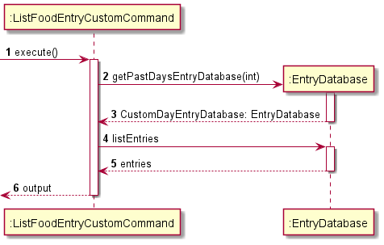
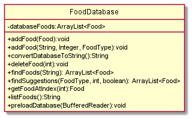
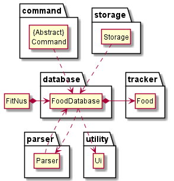

Developer Guide
===============

Content
-------

1. [Product Scope](#Product-Scope)
2. [Quick Start](#quick-start)
3. [User Story](user-story)
4. [Application Architecture](#Architecture)
   - Overall Architecture
   - Food Tracker
   - Food Database
   - User
   - Summary
   - Suggest
   - Command
   - Storage
   - Parser
   - Ui
5. [Implementation](#Implementation)
6. [Instruction for manual testing](#instruction-for-manual-testing)
7. [Non-functional Requirement](#NF-Requirement)

##Acknowledgements

{list here sources of all reused/adapted ideas, code, documentation, and third-party libraries -- include links to the original source as well}

##Product scope

### Target user profile

NUS Computer Engineering students reside in UTown going on diet.

### Value proposition

Help user to keep track of their daily calorie intake, and manage their diet wisely.

##Quick Start

1. Ensure you have Java 11 or above installed in your Computer. 
2. Download the latest fitnus.jar from here (no link for now). 
3. Copy the file to the folder you want to use as the home folder for your WellNUS Tracker 
4. Type the following command in your terminal to run this program: `java -jar fitnus.jar` (You should change directory to where the `wellnus.jar` file is located or provide the absolute path of `wellnus.jar`).
5. Some example commands you can try: 
   - `add Chicken Rice /cal 607`: Adds an entry of Chicken Rice with 607 calories to your food tracker and food database. 
   - `list food`: Lists all foods in database 
   - `list intake /DAY`: Lists all entries in the food tracker for the day. 
   - `exit`: Exits the app.  

Refer to the User Guide (no link for now) for details of each command.

##User Stories

|Version| As a ... | I want to ... | So that I can ...| |--------|----------|---------------|------------------| |v1.0|new user|see usage instructions|refer to them when I forget how to use the application| |v2.0|user|find a to-do item by name|locate a to-do without having to go through the entire list|

##Architecture

###Overall Architecture

  
The Architecture Diagram given above explains the high-level design of the App.  

Given below is a quick overview of main components and how they interact with each other.

The entry point of the app is the `FitNUS` class, where the application is run and all other components are initialised and used.

The primary components of the app are listed below:
- `Storage`: For handling backend storage.
- `Parser`: For parsing user input.
- `Command`: The abstract class that all other command classes inherit from
- `Ui`: For displaying information to the user.
- `EntryDatabase`: For handling all functionality regarding food tracker entries.
- `FoodDatabase`: For handling all functionality regarding food database entries.
- `User`: For handling all functionality regarding personalisation of user experience.

---

### Food Tracker

####Add Food Entry Feature

The add food entry mechanism is facilitated by `AddFoodEntryCommand`. It extends `Command` and stores the data internally into `EntryDatabase` and `FoodDatabase`.

Additionally, it implements the following operations:
- `EntryDatabase#addEntry(Entry)` -- Adds a new entry into the entry database
- `FoodDatabase#addFood` -- Adds a new food into the food database
  

####Edit Food Entry Feature

The edit food entry mechanism is facilitated by `EditFoodEntryCommand`. It extends `Command` and stores the data internally into `EntryDatabase` and `FoodDatabase`.

Additionally, it implements the following operations:
- `EntryDatabase#editEntryAtIndex(int, Entry)` -- Edits the entry at the specified index of the entry database
- `FoodDatabase#addFood` -- Adds a new food into the food database
  

####List Food Entry Feature

The list food entry mechanism is facilitated by `ListFoodEntryAllCommand`, `ListFoodEntryDayCommand`, `ListFoodEntryWeekCommand`. They extend `Command`.

Additionally, they implement the following operations:
- `EntryDatabase#listEntries()` -- Lists all entries within the entry database
- `EntryDatabase#getPastDaysEntryDatabase(int)` -- returns a subset of the original entry database containing only entries of the past specified days

---

### Food Database

  
The `FoodDatabase` component - `addFood()` Adds a Food object to the database. 
- `convertDatabaseToString()` Returns a String representation of all Food objects in the database. 
- `deleteFood()` Removes a specified Food object from the database. 
- `findFoods()` Returns an ArrayList containing matching Food objects based on a keyword. 
- `findSuggestions()` Returns an ArrayList containing matching Food objects based on the specified FoodType and the user's calorie goal. 
- `getFoodAtIndex()` Returns the Food object at the specified index. 
- `listFoods()` Returns a formatted String of all Food objects to be printed. 
- `preloadDatabase()` Preloads the database using data from the text file. 

-   
The diagram above showcases the relationships between FoodDatabase object and various components.

---

### User

#### Weight Tracker

The weight tracker exists as an ArrayList called `WeightProgressEntries` within the User class. The ArrayList contains objects of class `WeightProgressEntry`.

#### Storage Component

Weight progress entries are stored in a text file in the following format:  
`WEIGHT | DATE(YYYY-MM-DD)` Example: `100 | 2021-03-01`  
The weight progress storage file is updated every time the user sets or updates their weight for the day, as all storage files are updated at every iteration of the main loop using the `saveFitNus` method.  
On startup, the storage file is parsed and the corresponding WeightProgressEntry objects are created and loaded into the ArrayList.

#### User Component

How the User component works in the context of the weight tracker:

1.  When the user inputs the weight setting command, User is called upon to execute the function to update the user's weight and weight tracker.
2.  In all cases, the weight attribute of the initialised User object will be updated to the new weight inputted by the user.
3.  If no weight progress entries were present in the storage text file, the tracker does not attempt to calculate the difference between the updated weight and the previous weight.
4.  If the latest weight progress entry was recorded on the same day, that entry is updated with the new weight (that is, no new entry is added to the weight tracker). Otherwise, a new weight progress entry is created in the ArrayList with the current date and new weight.

---

### View Diet Summary

The Summary class provides an overview of user's diet over the past week/month.

#### command format

`summary /week` or `summary /month`  
`Summary` class provides two methods `generateWeekSummaryReport()` and `generateMonthSummaryReport()` to give the user weekly/monthly report of their diets.

*   `generateWeekSummaryReport()` shows weekly calorie intake trend graph, average daily calorie intake, and the most/least frequently eaten food over past 7 days.
*   `generateMonthSummaryReport()` shows average daily calorie intake, and the most/least frequently eaten food over this month.

#### UML Sequence Diagram

The following sequence diagram describes the operation of the `generateWeekSummary()`.  
  
The following sequence diagram describes the operation of `generateMonthSummary()`.  

---

### Command

- Different kinds of commands inherit from abstract class command, and inside which there is an abstract method called `execute()`
- Subclasses are instantiated through parser after parsing the user's input, and each command has its own `execute()` command to perform its task.

---

### Storage

The Storage class reads and writes data to and from the text file.

<<<<<<< Updated upstream
#### Storage format

**Every line in each text file represents one object / entry / item**

*   FoodDatabase:`FOODNAME | CALORIE_VALUE`  
    Example: `Nasi Lemak | 400`   `Ramen | 600`
*   EntryDatabase:`MEALTYPE | FOODNAME | CALORIE_VALUE | DATE`  
    Example: `Dinner | Ramen | 500 | 2021-10-20`   `Lunch | Fried rice | 600 | 2021-10-20`
*   User:`CALORIE_GOAL | GENDER`  
    Example: `1000 | 0`
*   User weight:`WEIGHT | DATE`  
    Example: `60.0 | 2021-07-20`   `59.0 | 2021-08-20`   `58.0 | 2021-09-20`   `45.0 | 2021-10-21`

#### Implementation

1.  **Saving to file**

    `FoodDatabase`, `EntryDatabase`, and `User` classes each have a method to convert its data to String format. This String is then saved to the text file.  
    For instance, when saving the `FoodDatabase` data, `Storage` calls the `convertDatabaseToString()` method to obtain the String representation of all the data within the \`FoodDatabase\`. This String is then written to the text file.
2.  **Loading from file**

    `Storage` makes use of the `BufferedReader` and `FileInputStream` provided by `java.io` to access the contents of the storage text files. This is then passed to the respective objects for preloading.  
    For instance, when preloading the `FoodDatabase` data, `Storage` accesses the storage text file and passes the file contents to the `preLoadDatabase()` method in ,`FoodDatabase` which populates the ArrayList in `FoodDatabase`.

#### UML Sequence Diagram

The following sequence diagram describes the operation of the `saveFoodDatabase()` operation.  

---

### Parser Component

The parser component makes use of the user input String from the `fitNus` class to detect the type of `Command` object called. It then returns a `Command` object that represents the type of command called through the input.

*   determines the type of `Command` object and returns it.
*   handles input exceptions and returns relevant `FitNusException` command.

#### Implementation

*   ##### Identifying type of method called

    The `Parser` is invoked through the `parseCommandType()` method. The input is first split up by identifying a space character. If no space character is detected, and the `help` or `exit` method was not called, a `FitNusException` is thrown. The first string element is then compared with default list of commands to determine the type of method called using if-else statements.

Instructions for manual testing
-------------------------------
=======
<h4>Storage format</h4>

<strong>Every line in each text file represents one object / entry / item</strong>

<ul>
<li>
FoodDatabase:<code>FOODNAME | CALORIE_VALUE</code>  
Example: <code>Nasi Lemak | 400</code> &nbsp; <code>Ramen | 600</code>
</li>

<li>
EntryDatabase:<code>MEALTYPE | FOODNAME | CALORIE_VALUE | DATE</code>  
Example: <code>Dinner | Ramen | 500 | 2021-10-20</code> &nbsp; <code>Lunch | Fried rice | 600 | 2021-10-20</code>
</li>

<li>
User:<code>CALORIE_GOAL | GENDER</code>  
Example: <code>1000 | 0</code> &nbsp;
</li>

<li>
User weight:<code>WEIGHT | DATE</code>  
Example: <code>60.0 | 2021-07-20</code> &nbsp; <code>59.0 | 2021-08-20</code> &nbsp; <code>58.0 | 2021-09-20</code> &nbsp; <code>45.0 | 2021-10-21</code>
</li>

</ul>

<h4>Implementation</h4>
<ol>
<li>

<strong>Saving to file</strong>

<code>FoodDatabase</code>, <code>EntryDatabase</code>, and <code>User</code> classes each have a method to convert
its data to String format. This String is then saved to the text file.  
For instance, when saving the <code>FoodDatabase</code> data, <code>Storage</code> calls the <code>convertDatabaseToString()</code>
method to obtain the String representation of all the data within the `FoodDatabase`. This String is then written to the text file.
</li>

<li>

<strong>Loading from file </strong>

<code>Storage</code> makes use of the <code>BufferedReader</code> and <code>FileInputStream</code> provided  by <code>java.io</code> to access 
the contents of the storage text files. This is then passed to the respective objects for preloading.  

For instance, when preloading the <code>FoodDatabase</code> data, <code>Storage</code> accesses the storage text file
and passes the file contents to the <code>preLoadDatabase()</code> method in <code>FoodDatabase</code> which populates
the ArrayList in <code>FoodDatabase</code>.
</li>

</ol>

<h4>UML Sequence Diagram </h4>
The following sequence diagram describes the operation of the <code>saveFoodDatabase()</code> operation. 

<li>
<h3>Parser Component</h3>

The parser component makes use of the user input String from the <code>fitNus</code> class to detect the type of <code>Command</code> object called.
It then returns a <code>Command</code> object that represents the type of command called through the input.

<ul>
<li>determines the type of <code>Command</code> object and returns it.</li>
<li>handles input exceptions and returns relevant <code>FitNusException</code> command.</li>
</ul>

<h4>Implementation</h4>
<ul>
<li><h5>Identifying type of method called</h5>

The <code>Parser</code> is invoked through the <code>parseCommandType()</code> method. The input is first split up by identifying a space character.
If no space character is detected, and the <code>help</code> or <code>exit</code> method was not called, a <code>FitNusException</code> is thrown. The first string element is 
then compared with default list of commands to determine the type of method called using if-else statements.
</li></ul></li></ol>

<h2 id="instruction-for-manual-testing"> Instructions for manual testing</h2>
>>>>>>> Stashed changes

{Give instructions on how to do a manual product testing e.g., how to load sample data to be used for testing}

Non-Functional Requirements
---------------------------

1. Data of users and foods should be stored and retrieved swiftly without delay, even for a long time user with very a big data set. 
2. User's and food's data should be kept safely, and it is crashed, the program should be able to detect it.

Glossary
--------

\*glossary item\* - Definition