# Developer Guide

## Content

1. [Product Scope](#product-scope)
2. [Quick Start](#quick-start)
3. [User Story](#user-stories)
4. [Application Architecture](#architecture)
   - [Overall Architecture](#overall-architecture)
   - [Entry](#entry)
   - [Entry Database](#entry-database)
   - [Food Database](#food-database)
   - [User](#user)
   - [Summary](#summary)
   - [Suggest](#view-food-suggestions)
   - [Command](#command)
   - [Storage](#storage)
   - [Parser](#parser)
5. [Implementation](#implementation)
   - [Add Food Entry](#add-food-entry)
   - [Edit Food Entry](#edit-food-entry)
   - [List Food Entry](#list-food-entry)
   - [Delete Food Entry](#delete-food-entry)
6. [Instruction for manual testing](#instructions-for-manual-testing)
7. [Non-functional Requirement](#nf-requirements)

## Product scope

### Target user profile

NUS Computer Engineering students reside in UTown going on diet.

### Value proposition

Help user to keep track of their daily calorie intake, and manage their diet wisely.

## Quick Start

1. Ensure you have Java 11 or above installed in your Computer. 
2. Download the latest fitnus.jar from here (no link for now). 
3. Copy the file to the folder you want to use as the home folder for your WellNUS Tracker 
4. Type the following command in your terminal to run this program: `java -jar fitnus.jar` (You should change directory to where the `wellnus.jar` file is located or provide the absolute path of `wellnus.jar`).
5. The application will prompt first-time users (i.e. users with incomplete or missing user data) to set up their profile.
6. Some example commands you can try: 
   - `add Chicken Rice /cal 607`: Adds an entry of Chicken Rice with 607 calories to your EntryDatabase and food database. 
   - `list food`: Lists all foods in database 
   - `list intake /DAY`: Lists all entries in the EntryDatabase for the day. 
   - `exit`: Exits the app.  

Refer to the User Guide (no link for now) for details of each command.

## User Stories

|Version| As a ... | I want to ... | So that I can ...| 
|--------|----------|---------------|------------------| 
|v1.0|new user|see usage instructions|refer to them when I forget how to use the application| 
|v2.0|user|find a to-do item by name|locate a to-do without having to go through the entire list|

## Architecture

### Overall Architecture

  
The Architecture Diagram given above explains the high-level design of the App.  

Given below is a quick overview of main components and how they interact with each other.

The entry point of the app is the `FitNUS` class, where the application is run and all other components are initialised and used.

The primary components of the app are listed below:
- `Storage`: For handling backend storage.
- `Parser`: For parsing user input.
- `Command`: The abstract class that all other command classes inherit from
- `Ui`: For displaying information to the user.
- `EntryDatabase`: For handling all functionality regarding entries.
- `FoodDatabase`: For handling all functionality regarding food database entries.
- `MealPlanDatabase`: For handling all functionality regarding meal plan database entries.
- `User`: For handling all functionality regarding personalisation of user experience.

#### How the overall architecture works

1. When the user enters a command, `FitNUS` uses the Parser class to parse the user command.
2. This results in a `Command` object (more precisely, an object of one of its subclasses e.g., `AddFoodEntryCommand`). 
3. The `Command` object calls its `execute` method which performs the function required.
   - Since the `execute` method receives the `FoodDatabase`, `EntryDatabase` and `MealPlanDatabase` initialised in `FitNUS`, it is able to perform operations related to those components (e.g. to add an entry).
4. The `execute` method returns a `String` object that contains the outcome message of the command that was executed, which is displayed to the user by the `Ui` component.
---

### Entry


---

### EntryDatabase

The EntryDatabase is represented by the class `EntryDatabase`.

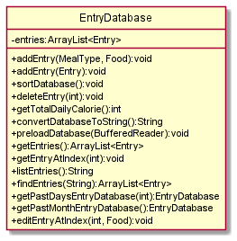

The `EntryDatabase` class consists of an ArrayList of Entry. It handles all functionalities 
that uses/amends the EntryDatabase. 

The `EntryDatabase` component consists of:
- `addEntry()` Adds an Entry object to the database.
- `sortDatabase()` Sorts the database by date.
- `deleteEntry(int)` Removes a specified Entry object from the database.
- `getTotalDailyCalorie()` Returns the total calorie intake for the day.
- `convertDatabaseToString()` Returns a String representation of all Entry objects in the database.

  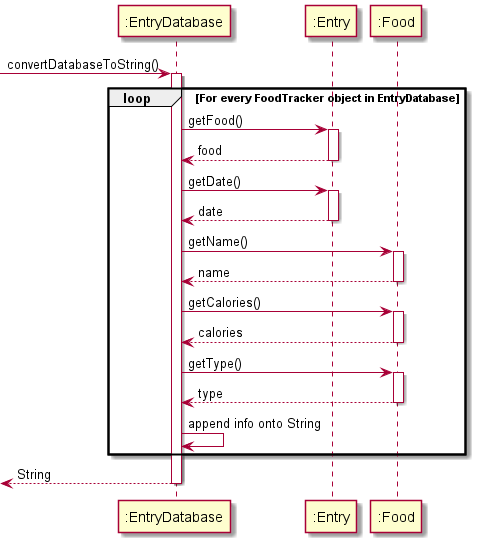

- `preloadDatabase(BufferedReader)` Preloads the database using data from the text file.

  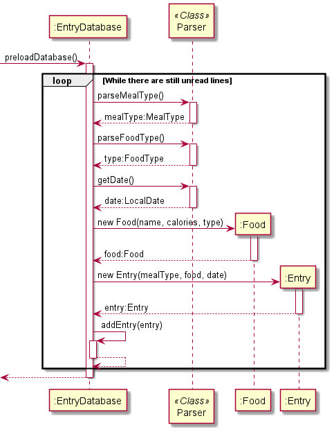

- `getEntries()` Returns an ArrayList of all Entry objects within the database.
- `getEntryAtIndex(int)` Returns the Entry object at the specified index.
- `listEntries()` Returns a formatted String of all Food objects to be printed.
- `findEntries(String)` Returns an ArrayList containing matching Entry objects based on a keyword.
- `getPastDaysEntryDatabase(int)` Returns a subset of the original database consisting of Entry objects added in the current day

  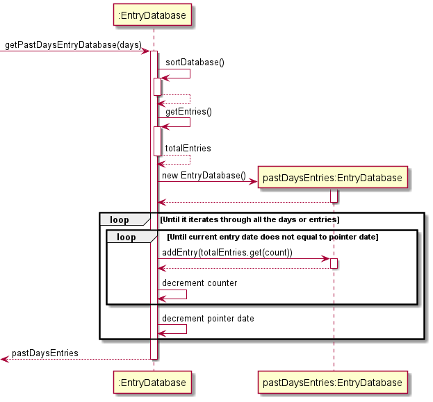

- `getPastMonthsEntryDatabase()` Returns a subset of the original database consisting of Entry objects added in the current month

  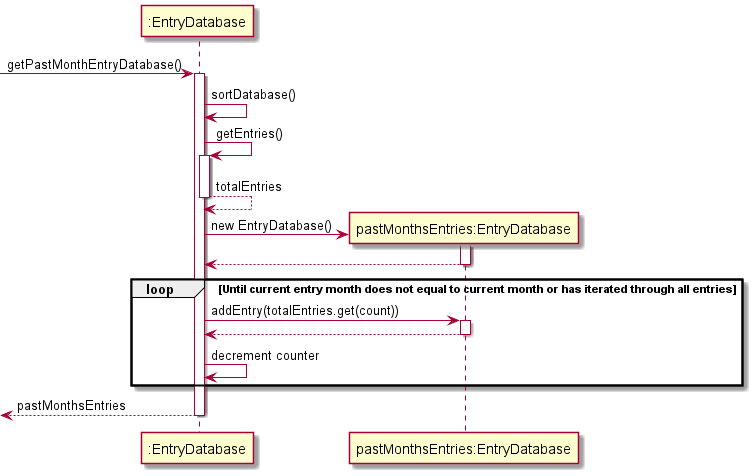 

- `editEntryAtIndex(int, Food)` Edits the Entry object at the specified index to the new specified Food object

The diagram below showcases the relationships between EntryDatabase object and various components.

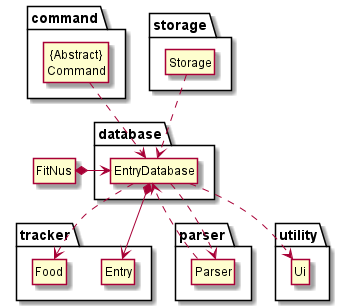


---

### Food Database

The `FoodDatabase` is used to keep a record of all the various types of `Food` objects.
Keeping a record of all types of `Food` allows users to have a more seamless
experience as they do not have to input all details when adding an `Entry` to the `EntryDatabase`.

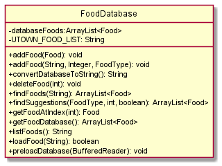  

The `FoodDatabase` component consists of:
- ArrayList of `Food` objects to store `Food` objects.
- `addFood()` Adds a Food object to the database. 
- `convertDatabaseToString()` Returns a String representation of all Food objects in the database. 
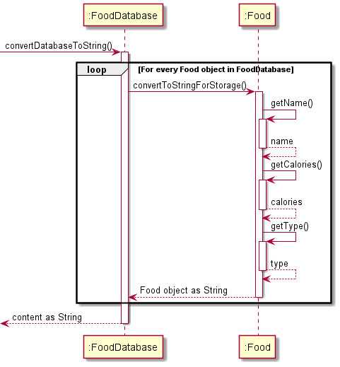
- `deleteFood()` Removes a specified Food object from the database. 
- `findFoods()` Returns an ArrayList containing matching Food objects based on a keyword. 
- `findSuggestions()` Returns an ArrayList containing matching Food objects based on the specified FoodType 
and the user's calorie goal. The code snippet below shows how this method makes use of `stream` to filter
matching Food objects.
```
public ArrayList<Food> findSuggestions(Food.FoodType type, int calories, boolean isSort) {
    ArrayList<Food> matchingSuggestions = (ArrayList<Food>) databaseFoods.stream()
            .filter(t -> t.getType().equals(type))
            .filter(c -> c.getCalories() < calories)
            .collect(Collectors.toList());
    if (isSort) {
        matchingSuggestions.sort(Comparator.comparing(Food::getCalories));
    }
    return matchingSuggestions;
}
```
- `getFoodAtIndex()` Returns the Food object at the specified index. 
- `listFoods()` Returns a formatted String of all Food objects to be printed. 
- `preloadDatabase()` Preloads the database using data from the text file.
   <br /> 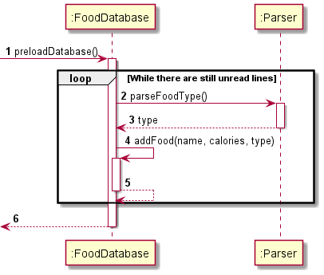

The class diagram below showcases the relationships between the `FoodDatabase` class and various components.

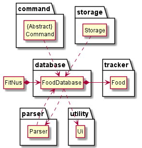  


---

### Meal Plan Database

The meal plan database is responsible for storing custom meal plans created by the user. 
Each meal plan consists of a name, and a list of `Food` items linked to the meal plan.
The class diagram of the `MealPlanDatabase` is shown below.


The `MealPlanDatabase` component consists of:
- `convertFoodToString(ArrayList<Food>)` Returns a string representation of all MealPlan objects in the database.
- `addMealPlan(MealPlan)` Adds a MealPlan object to the database.
- `getMealAtIndex(int)` Returns the MealPlan object at that index inside the database. 
- `convertDatabaseToString()` Returns a string presentation of the MealPlanDatabase object.

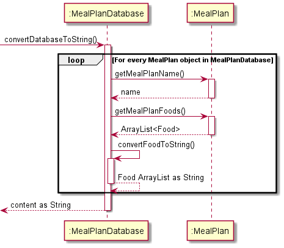

- `preloadDatabase(BufferedReader)` Preloads the database using data from the text file containing meal plans.
  
The `preloadDatabase()` method is used to populate `databaseMealPlans` when FitNus is first launched.

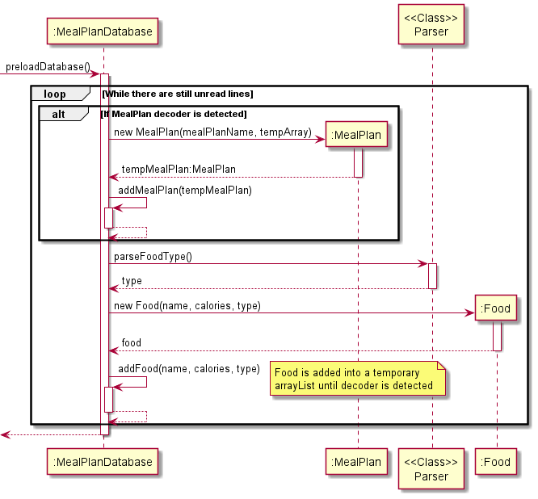

- `listMealPlan()` Returns a String representation of all MealPlan objects saved in the database by stating its name and `Food` items under it.
  
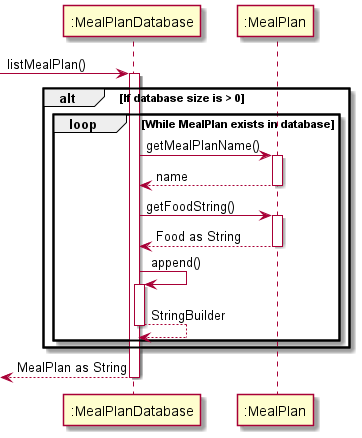

#### Implementation
`MealPlanDatabase` is first populated when the `preloadDatabase()` method is called from the `Storage` class. 
It reads the lines inside the `mealplan.txt` using a `BufferedReader`. The class has the following features:
- Automatically detect the name of an individual meal plan.
- Converts string representation of `Food` items under each meal plan into an `ArrayList` of`Food` objects.
- Detects when all the `Food` items under each meal plan has been added and start parsing the next meal plan if it exists.
- Add `MealPlan` object into `databaseMealPlans`, which is an `ArrayList` of `MealPlan` objects.

The class diagram below showcases the relationships between the `MealPlanDatabase` class and its various components.


--- 

### User component

(put class diagram here)

The `User` component:
- Stores the user's personal data eg gender, age, height, weight
- Stores the user's weight progress data i.e. all `WeightProgressEntry` objects (which are contained in an `ArrayList` as an attribute in `User`)
- Performs functions related to the user's calorie goal such as setting and generating the calorie goal

#### Weight tracker feature

The weight tracker consists of the `ArrayList` of `WeightProgressEntry` objects. Each `WeightProgressEntry` object stores a date as a `LocalDate` and the weight corresponding to the date stored.

The `updateWeightAndWeightTracker` method allows the user to update their weight and the weight tracker. This is performed as shown in the following sequence diagram:


How updating the weight tracker works:

1. When the user inputs the command to set weight, `User` is called upon to execute the function to update the user's weight and weight tracker.
2. In all cases, the weight attribute of the initialised `User` object will be updated to the new weight entered by the user.
3. If the latest weight progress entry was recorded on the same day, that entry is updated with the new weight (that is, no new entry is added to the weight tracker). Otherwise, a new weight progress entry is created in the `ArrayList` with the current date and new weight.

The weight tracker can also perform the following operations:
- `convertWeightDataToString` - Converts the weight data in the weight tracker to a `String` to be stored in a text file. Weight progress entries are stored in a text file in the following format:  
  `WEIGHT | DATE(YYYY-MM-DD)` (e.g.`100 | 2021-03-01`)
- `preloadWeightData` - Loads weight tracker data from the text file to the `ArrayList` of `WeightProgressEntry` objects
- `getWeightProgressDisplay` - Returns a `String` displaying the weight tracker to the user.

#### Calories remaining feature

The calories remaining feature allows the user to check how many more calories they can consume for the day. This is implemented by the `getCaloriesRemaining` method.


#### Generate and set calorie goal feature

The generate and set calorie goal feature generates a calorie goal according to the user's desired weekly weight change, age, height, weight and gender, and then sets the user's calorie goal to the generated goal. 

This is performed as shown in the following sequence diagram:


- The following formulas are used to generate the calorie goal:
  - For females: calorieGoal = [[655.1 + (9.563 x weight in kg) + (1.850 x height in cm) - (4.676 x age in years)] * 1.55] - (weeklyLossInKg * 1000)
  - For males: calorieGoal = [[66.47 + (13.75 x weight in kg) + (5.003 x height in cm) - (6.755 x age in years)] * 1.55] - (weeklyLossInKg * 1000)


> ⚠️ Notes about the generate and set calorie goal feature:
>- The weekly change is the absolute value of the weekly change in weight. It cannot be greater than 1.0, which is the upper bound for the recommended healthy weight change per week.

#### Setting user data feature

The user is able to change their personal data at any point while using the app. 

Setting gender, age and height operate in a similar way, as shown in the example sequence diagram below where setting height is performed:


> ⚠️ Notes about the setting user data feature:
> - The age (in years) can only be set to an integer within the range of 12 to 100
> - The height (in cm) can only be set to an integer within the range of 40 to 300
> - The weight (in kg) can only be set to a number within the range of 0 to 500


---

### Summary

The Summary class provides an overview of user's diet over the past week/month.

#### command format

`summary /week` or `summary /month`  
`Summary` class provides two methods `generateWeekSummaryReport()` and `generateMonthSummaryReport()` to give the user weekly/monthly report of their diets.

*   `generateWeekSummaryReport()` shows weekly calorie intake trend graph, average daily calorie intake, and the most/least frequently eaten food over past 7 days.
*   `generateMonthSummaryReport()` shows average daily calorie intake, and the most/least frequently eaten food over this month.

#### UML Sequence Diagram

The following sequence diagram describes the operation of the `generateWeekSummary()`.  
  
The following sequence diagram describes the operation of `generateMonthSummary()`.  


---
### View Food Suggestions
#### This feature allows users to find food suggestions based on food type and calorie goal.


The sequence diagram below describes the execution of the `ViewSuggestionsCommand`.
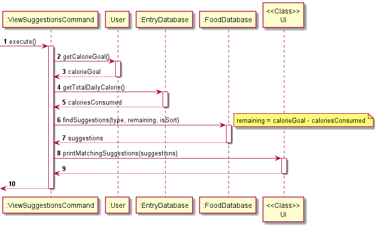 

Here are the general steps taken when the `ViewSuggestionsCommand` is executed.
1. The `ViewSuggestionsCommand` obtains the user's calorie goal (`calorieGoal`) from the `user` object 
and current calorie consumption (`caloriesConsumed`) from the `entryDatabase` object.
2. The remaining calories for the day is calculated by `calorieGoal - caloriesConsumed`.
3. `findSuggestions()` method from `foodDatabase` is called to filter out all matching `Food` objects
based on the remaining calories and specified type. The user also has the option to have the result sorted 
in ascending order of calories. This is indicated by the boolean `isSort` variable.
4. The returned ArrayList of matching `Food` objects is passed to `Ui` to be printed to the user.

---

### Command


The `Command` class is an abstract class that all other specific command classes (eg AddFoodEntryCommand, DeleteEntryCommand) inherit from. 

The `Command` component
    
- Contains an abstract method `execute`. In the specific command classes that inherit from `Command`, `execute` performs the function that the command describes. (For example, in `AddFoodEntryCommand`, `execute` adds an entry to the EntryDatabase.) 

#### Add Food Entry Feature

The add food entry mechanism is facilitated by `AddFoodEntryCommand`. It extends `Command` and stores the data internally into `EntryDatabase` and `FoodDatabase`.

Additionally, it implements the following operations:
- `EntryDatabase#addEntry(Entry)` -- Adds a new entry into the entry database
- `FoodDatabase#addFood` -- Adds a new food into the food database

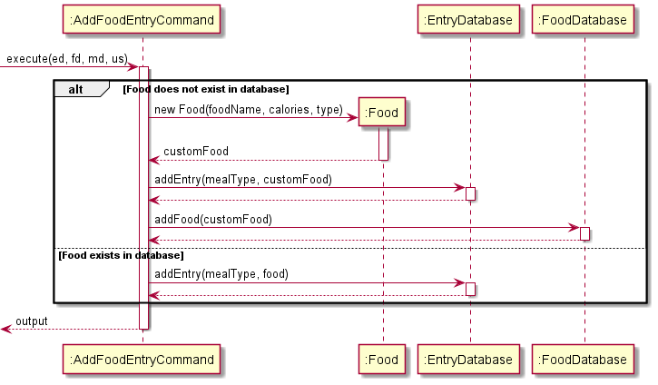

#### Edit Food Entry Feature

The edit food entry mechanism is facilitated by `EditFoodEntryCommand`. It extends `Command` and stores the data internally into `EntryDatabase` and `FoodDatabase`.

Additionally, it implements the following operations:
- `EntryDatabase#editEntryAtIndex(int, Entry)` -- Edits the entry at the specified index of the entry database
- `FoodDatabase#addFood` -- Adds a new food into the food database
  
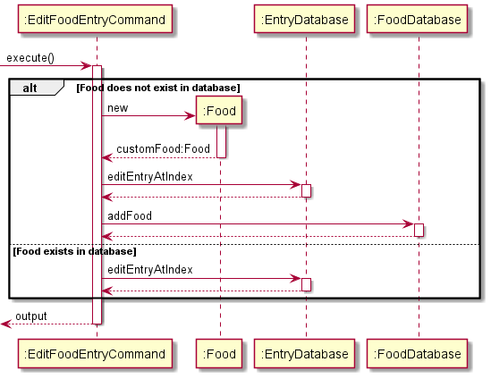

#### List Food Entry Feature

The list food entry mechanism is facilitated by `ListFoodEntryAllCommand`, `ListFoodEntryDayCommand`, `ListFoodEntryWeekCommand`. They extend `Command`.

Additionally, they implement the following operations:
- `EntryDatabase#listEntries()` -- Lists all entries within the entry database
- `EntryDatabase#getPastDaysEntryDatabase(int)` -- returns a subset of the original entry database containing only entries of the past specified days

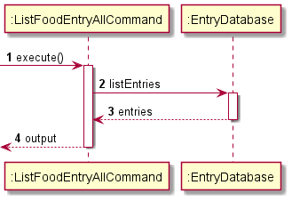


---

### Storage

The Storage class reads and writes data to and from the text file.

#### Storage format

**Every line in each text file represents one object / entry / item**

*   FoodDatabase:`FOODNAME | CALORIE_VALUE`  
    Example: `Nasi Lemak | 400`   `Ramen | 600`
*   EntryDatabase:`MEALTYPE | FOODNAME | CALORIE_VALUE | DATE`  
    Example: `Dinner | Ramen | 500 | 2021-10-20`   `Lunch | Fried rice | 600 | 2021-10-20`
*   User:`CALORIE_GOAL | GENDER`  
    Example: `1000 | 0`
*   User weight:`WEIGHT | DATE`  
    Example: `60.0 | 2021-07-20`   `59.0 | 2021-08-20`   `58.0 | 2021-09-20`   `45.0 | 2021-10-21`

#### Implementation

1.  **Saving to text file**

    `FoodDatabase`, `EntryDatabase`, and `User` classes each have a method to convert its data to String format. This String is then saved to the text file.  
    For instance, when saving the `FoodDatabase` data, `Storage` calls the `convertDatabaseToString()` method to obtain the String representation of all the data within the \`FoodDatabase\`. This String is then written to the text file.
2.  **Loading from text file**

    `Storage` makes use of the `BufferedReader` and `FileInputStream` provided by `java.io` to access the contents of the storage text files. This is then passed to the respective objects for preloading.  
    For instance, when preloading the `FoodDatabase` data, `Storage` accesses the storage text file and passes the file contents to the `preLoadDatabase()` method in ,`FoodDatabase` which populates the ArrayList in `FoodDatabase`.

#### Implementation considerations

1. The `Path` of each text file is hardcoded within the `Storage` class. This eliminates
the need to pass the `Path` of the destination file each time. For example, to save the `FoodDatabase`
contents, the method call is `saveFoodDatabase()` rather than `saveFoodDatabase(PATH)`.
2. All public methods are declared as `static` methods. This allows various methods within the
`Storage` class to be called without having to instantiate a `Storage` object.


#### UML Sequence Diagram

The following sequence diagram describes the operation of the `saveFoodDatabase()` operation.  
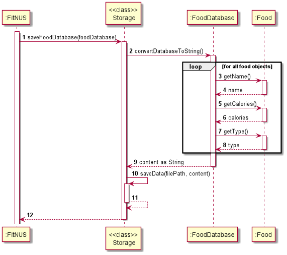

---

### Parser

The parser component makes use of the user input String from the `fitNus` class to detect the type of `Command` object called. It then returns a `Command` object that represents the type of command called through the input.

*   determines the type of `Command` object and returns it.
*   handles input exceptions and returns relevant `FitNusException` command.

#### Implementation

*   ##### Identifying type of method called

    The `Parser` is invoked through the `parseCommandType()` method. The input is first split up by identifying a space character. If no space character is detected, and the `help` or `exit` method was not called, a `FitNusException` is thrown. The first string element is then compared with default list of commands to determine the type of method called using if-else statements.

## Implementation

### Add Food Entry

### Edit Food Entry

### List Food Entry

### Delete Food Entry

### User Profile Setup and Editing

This feature allows the user to set up and
edit various attributes of their user profile such as their
gender, height, weight, age and daily calorie goal.
Given below is an example usage scenario and
how the user profile setup and editing
mechanism behaves at each step respectively.

#### User Profile Setup

1. The user launches the application, causing `FitNUS#initialiseFitNUS`
to be called. Since this is the first time the user is using the app,
the `user.txt` file containing the user data does not exist yet,
prompting FitNUS to create an empty text file storing the user data
(user.txt). 

2. Since the text file is empty, the check for whether
the user data in the storage is valid returns false, causing FitNUS to
begin the user profile setup process.

    > ⚠️ Note: If `user.txt` is not empty but the user data is
    in an invalid or incomplete format, 
    the user profile setup process is continued. 

3. FitNUS begins the gender setting process by calling 
`FitNUS#initialiseAttribute` for the gender. This prompts the user to 
enter the character indicating their gender. 
The entered character is appended to a string 
"gender /set " (eg if the user entered "m", the string becomes
 "gender /set m"). This string is passed into `Parser#parseCommandType`.

4. If the user input for the character indicating the gender is valid,
`Parser#parseCommandType` returns the corresponding `SetGenderCommand` object.
The `execute` method of the `SetGenderCommand` object is called, which
sets the `gender` attribute of the `User` object. This terminates the 
gender initialisation process.

5. If any `FitNUSException` was thrown in steps 4 and 5 due to invalid user
input, steps 4 and 5 are repeated until no exception is thrown (i.e. valid
user input was received).

6. Steps 3 to 6 are repeated for `age`, `height` and `weight` attributes.

7. A daily calorie goal that allows the user to maintain their current weight
is generated by calling `User#calculateCalorieGoal`
and the `calorieGoal` attribute is set to the generated goal. 

#### User Profile Editing

1. The user executes the `height /set 180` command to set their height to 180cm. 
`SetHeightCommand#execute` is called, which sets the `height` attribute
of the `User` object to 180 by calling `User#setHeight`.

### Record Weight

This feature allows the user to record their weight for the day in the
weight tracker and also update their weight in their user profile.
Given below is an example usage scenario and
how its mechanism behaves at each step.

1. The user executes the `weight /set 65.5` command to set their weight to 65.5 kg.
`SetWeightCommand#execute` is called, which calls `User#updateWeightAndWeightTracker`.
2. The `weight` attribute of the `User` object is set to 65.5.
3. If a weight record for the current day already exists in the weight tracker,
that record is replaced with another record with the updated weight. Otherwise, a
new weight record with the updated weight is created and added to the weight tracker.

### Generate Calorie Goal

1. The user executes the `weight /set 65.5` command to set their weight to 65.5 kg.
   `SetWeightCommand#execute` is called, which calls `User#updateWeightAndWeightTracker`.

### View Remaining Calories

This feature allows the user to view how many calories they have remaining
for the day before they hit their daily calorie goal. 
Given below is an example usage scenario and
how its mechanism behaves at each step.

1. The user executes the `calorie /remain` command to view their remaining calories
for the day. `ViewRemainingCalorieCommand#execute` is called, which calls `User#getCaloriesRemaining`.
2. `EntryDatabase#getTotalDailyCalorie` is then called, which adds up the calories of all
entries in the food tracker. This is subtracted from the user's daily calorie goal. 
The resulting calories remaining is then displayed to the user. 

## Instructions for manual testing

=======
<h4>Storage format</h4>
<div><strong>Every line in each text file represents one object / entry / item</strong></div>
<ul>
<li>
FoodDatabase:<code>FOODNAME | CALORIE_VALUE</code> <br/>
Example: <code>Nasi Lemak | 400</code> &nbsp; <code>Ramen | 600</code>
</li>

<li>
EntryDatabase:<code>MEALTYPE | FOODNAME | CALORIE_VALUE | DATE</code> <br/>
Example: <code>Dinner | Ramen | 500 | 2021-10-20</code> &nbsp; <code>Lunch | Fried rice | 600 | 2021-10-20</code>
</li>

<li>
User:<code>CALORIE_GOAL | GENDER</code> <br/>
Example: <code>1000 | 0</code> &nbsp;
</li>


<li>
User weight:<code>WEIGHT | DATE</code> <br/>
Example: <code>60.0 | 2021-07-20</code> &nbsp; <code>59.0 | 2021-08-20</code> &nbsp; <code>58.0 | 2021-09-20</code> &nbsp; <code>45.0 | 2021-10-21</code>
</li>

</ul>

<h4>Implementation</h4>
<ol>
<li>
<div><strong>Saving to file</strong></div>
<code>FoodDatabase</code>, <code>EntryDatabase</code>, and <code>User</code> classes each have a method to convert
its data to String format. This String is then saved to the text file. <br/>
For instance, when saving the <code>FoodDatabase</code> data, <code>Storage</code> calls the <code>convertDatabaseToString()</code>
method to obtain the String representation of all the data within the `FoodDatabase`. This String is then written to the text file.
</li>


<li>
<div><strong>Loading from file </strong></div>
<code>Storage</code> makes use of the <code>BufferedReader</code> and <code>FileInputStream</code> provided  by <code>java.io</code> to access 
the contents of the storage text files. This is then passed to the respective objects for preloading. <br/>

For instance, when preloading the <code>FoodDatabase</code> data, <code>Storage</code> accesses the storage text file
and passes the file contents to the <code>preLoadDatabase()</code> method in <code>FoodDatabase</code> which populates
the ArrayList in <code>FoodDatabase</code>.
</li>

</ol>

<h4>UML Sequence Diagram </h4>
The following sequence diagram describes the operation of the <code>saveFoodDatabase()</code> operation.<br/>
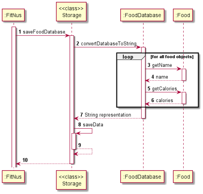


<li>
<h3>Parser Component</h3>
<div>The parser component makes use of the user input String from the <code>fitNus</code> class to detect the type of <code>Command</code> object called.
It then returns a <code>Command</code> object that represents the type of command called through the input.</div>

<ul>
<li>determines the type of <code>Command</code> object and returns it.</li>
<li>handles input exceptions and returns relevant <code>FitNusException</code> command.</li>
</ul>

<h4>Implementation</h4>
<ul>
<li><h5>Identifying type of method called</h5>

The <code>Parser</code> is invoked through the <code>parseCommandType()</code> method. The input is first split up by identifying a space character.
If no space character is detected, and the <code>help</code> or <code>exit</code> method was not called, a <code>FitNusException</code> is thrown. The first string element is 
then compared with default list of commands to determine the type of method called using if-else statements.
</li></ul></li>


<h2 id="instruction-for-manual-testing"> Instructions for manual testing</h2>

{Give instructions on how to do a manual product testing e.g., how to load sample data to be used for testing}

## NF Requirements

1. Data of users and foods should be stored and retrieved swiftly without delay, even for a long time user with very a big data set. 
2. User's and food's data should be kept safely, and it is crashed, the program should be able to detect it.
