# Developer Guide

## Content

1. [Product Scope](#product-scope)
2. [Quick Start](#quick-start)
3. [User Story](#user-stories)
4. [Application Architecture](#architecture)
   - [Overall Architecture](#overall-architecture)
   - [Entry](#entry)
   - [Entry Database](#entrydatabase)
   - [Food Database](#food-database)
   - [Meal Plan DataBase](#meal-plan-database)
   - [User](#user-component)
   - [Summary](#summary)
   - [Suggest](#view-food-suggestions)
   - [Storage](#storage)
   - [Parser](#parser)
5. [Implementation](#Implementation)
   - [Add Food Entry](#add-food-entry)
   - [Edit Food Entry](#edit-food-entry)
   - [List Food Entry](#list-food-entry)
   - [Delete Food Entry](#delete-food-entry)
6. [Instruction for manual testing](#instructions-for-manual-testing)
    - [Add Food Entry](#add-food-entry-instructions)
7. [Non-functional Requirement](#nf-requirements)

## Product scope

### Target user profile

NUS Computer Engineering students reside in UTown going on diet.

### Value proposition

Help user to keep track of their daily calorie intake, and manage their diet wisely.

## Quick Start

1. Ensure you have Java 11 or above installed in your Computer. 
2. Download the latest fitnus.jar from here (no link for now). 
3. Copy the file to the folder you want to use as the home folder for your WellNUS Tracker 
4. Type the following command in your terminal to run this program: `java -jar fitnus.jar` (You should change directory to where the `wellnus.jar` file is located or provide the absolute path of `wellnus.jar`).
5. The application will prompt first-time users (i.e. users with incomplete or missing user data) to set up their profile.
6. Some example commands you can try: 
   - `add Chicken Rice /cal 607`: Adds an entry of Chicken Rice with 607 calories to your EntryDatabase and food database. 
   - `list food`: Lists all foods in database 
   - `list intake /DAY`: Lists all entries in the EntryDatabase for the day. 
   - `exit`: Exits the app.  

Refer to the User Guide (no link for now) for details of each command.

## User Stories

| As a... | I can...                                 | So that I can...                                                    |
|---------|------------------------------------------|---------------------------------------------------------------------|
| User    | input entries every time I eat something | incorporate it seamlessly into my daily life                        |
| User    | edit my entries                          | make changes to my food entries at a later time                     |
| User    | delete entries in case I mistype         | -                                                                   |
| User    | list all my entries                      | look back at what I ate in the past                                 |
| User    | search food by a keyword                 | easily look for the food that I ate                                 |
| User    | create meal plans                        | add multiple food entries at once                                   |
| User    | record my current weight                 | look back and keep track of my weight in the future                 |
| User    | list out previous weight records         | look at my progress of weight loss/gain                             |
| User    | set my gender/height/age                 | get a more accurate calorie goal when using FitNUS                  |
| User    | set my calorie goal                      | have fixed objective of calorie intake                              |
| User    | generate my calorie goal                 | find out the optimal calorie intake to lose/gain  my desired weight |
| User    | list my user details                     | see my current user details at a glance                             |
| User    | show a summary of my past food intake    | easily see how much I have eaten and what I have  eaten at a glance |
| User    | ask for help                             | see all the available commands at a glance                          |
| User    | ask for food suggestions                 | get recommendations of food to eat based on my calorie intake       |
| User    | exit FitNUS                              | -                                                                   |


## Architecture

### Overall Architecture

  
The Architecture Diagram given above explains the high-level design of the App.  

Given below is a quick overview of main components and how they interact with each other.

The entry point of the app is the `FitNUS` class, where the application is run and all other components are initialised and used.

The primary components of the app are listed below:
- `Storage`: For handling backend storage.
- `Parser`: For parsing user input.
- `Command`: The abstract class that all other command classes inherit from
- `Ui`: For displaying information to the user.
- `EntryDatabase`: For handling all functionality regarding entries.
- `FoodDatabase`: For handling all functionality regarding food database entries.
- `MealPlanDatabase`: For handling all functionality regarding meal plan database entries.
- `User`: For handling all functionality regarding personalisation of user experience.

#### How the overall architecture works

1. When the user enters a command, `FitNUS` uses the Parser class to parse the user command.
2. This results in a `Command` object (more precisely, an object of one of its subclasses 
e.g., `AddFoodEntryCommand`). 
3. The `Command` object calls its `execute` method which performs the function required.
   - Since the `execute` method receives the `FoodDatabase`, `EntryDatabase` and 
   `MealPlanDatabase` initialised in `FitNUS`, it is able to perform operations related 
   to those components (e.g. to add an entry).

   > ⚠️ Notes about `execute` method:
   > The `execute` method takes in EntryDatabase, FoodDatabase, MealPlanDatabase and User
   > as parameters. In this developer guide, all sequence diagrams will denote the `execute`
   > method as `execute(ed, fd, md, us)` to represent this.

4. The `execute` method returns a `String` object that contains the outcome message of 
the command that was executed, which is displayed to the user by the `Ui` component.
---

### Entry


---

### EntryDatabase

The EntryDatabase is represented by the class `EntryDatabase`.


The `EntryDatabase` class consists of an ArrayList of Entry. It handles all functionalities 
that uses/amends the EntryDatabase. 

The `EntryDatabase` component consists of:
- `addEntry()` Adds an Entry object to the database.
- `sortDatabase()` Sorts the database by date.
- `deleteEntry(int)` Removes a specified Entry object from the database.
- `getTotalDailyCalorie()` Returns the total calorie intake for the day.
- `convertDatabaseToString()` Returns a String representation of all Entry objects in the database.

  

- `preloadDatabase(BufferedReader)` Preloads the database using data from the text file.

  

- `getEntries()` Returns an ArrayList of all Entry objects within the database.
- `getEntryAtIndex(int)` Returns the Entry object at the specified index.
- `listEntries()` Returns a formatted String of all Food objects to be printed.
- `findEntries(String)` Returns an ArrayList containing matching Entry objects based on a keyword.
- `getPastDaysEntryDatabase(int)` Returns a subset of the original database consisting of Entry objects added in the current day

  

- `getPastMonthsEntryDatabase()` Returns a subset of the original database consisting of Entry objects added in the current month

   

- `editEntryAtIndex(int, Food)` Edits the Entry object at the specified index to the new specified Food object

The diagram below showcases the relationships between EntryDatabase object and various components.


---

### Food Database

The `FoodDatabase` is used to keep a record of all the various types of `Food` objects.
Keeping a record of all types of `Food` allows users to have a more seamless
experience as they do not have to input all details when adding an `Entry` to the `EntryDatabase`.

  

The `FoodDatabase` component consists of:
- `databaseFoods`: ArrayList of `Food` objects to store `Food` objects.
- `UTOWN_FOOD_LIST`: Stores information about food available at UTown, NUS.
- `addFood()`: Adds a `Food` object to the database. 
- `convertDatabaseToString()`: Returns a String representation of 
all Food objects in the database. 

- `deleteFood()`: Removes a `Food` object at the specified index from the database. 
- `findFoods()`: Returns an ArrayList containing matching `Food` objects based on a keyword. 
- `findSuggestions()`: Returns an ArrayList containing matching Food objects based on the specified FoodType 
and the user's calorie goal. The code snippet below shows how this method makes use of `stream` to filter
matching Food objects.
```
public ArrayList<Food> findSuggestions(Food.FoodType type, int calories, boolean isSort) {
    ArrayList<Food> matchingSuggestions = (ArrayList<Food>) databaseFoods.stream()
            .filter(t -> t.getType().equals(type))
            .filter(c -> c.getCalories() < calories)
            .collect(Collectors.toList());
    if (isSort) {
        matchingSuggestions.sort(Comparator.comparing(Food::getCalories));
    }
    return matchingSuggestions;
}
```
- `getFoodAtIndex()`: Returns the `Food` object at the specified index. 
- `getFoodDatabase()`: Returns the whole `databaseFoods` ArrayList.
- `listFoods()`: Returns a formatted String of all Food objects to be printed. 
- `loadFood()`: Loads `Food` objects into the `FoodDatabase`.
- `preloadDatabase()`: Preloads the database using data from the text file.
   <br /> 

The class diagram below showcases the relationships between the `FoodDatabase` class and various components.

  


---

### Meal Plan Database

The meal plan database is responsible for storing custom meal plans created by the user. 
Each meal plan consists of a name, and a list of `Food` items linked to the meal plan.
The class diagram of the `MealPlanDatabase` is shown below.


The `MealPlanDatabase` component consists of:
- `convertFoodToString(ArrayList<Food>)` Returns a string representation of all MealPlan objects in the database.
- `addMealPlan(MealPlan)` Adds a MealPlan object to the database.
- `getMealAtIndex(int)` Returns the MealPlan object at that index inside the database. 
- `convertDatabaseToString()` Returns a string presentation of the MealPlanDatabase object.


- `preloadDatabase(BufferedReader)` Preloads the database using data from the text file containing meal plans.
  
The `preloadDatabase()` method is used to populate `databaseMealPlans` when FitNus is first launched.


- `listMealPlan()` Returns a String representation of all MealPlan objects saved in the database by stating its name and `Food` items under it.
  


#### Implementation
`MealPlanDatabase` is first populated when the `preloadDatabase()` method is called from the `Storage` class. 
It reads the lines inside the `mealplan.txt` using a `BufferedReader`. The class has the following features:
- Automatically detect the name of an individual meal plan.
- Converts string representation of `Food` items under each meal plan into an `ArrayList` of`Food` objects.
- Detects when all the `Food` items under each meal plan has been added and start parsing the next meal plan if it exists.
- Add `MealPlan` object into `databaseMealPlans`, which is an `ArrayList` of `MealPlan` objects.

The class diagram below showcases the relationships between the `MealPlanDatabase` class and its various components.


--- 

### User component

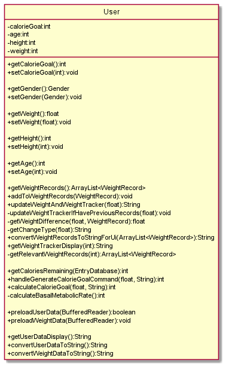

The `User` component:
- Stores the user's personal data eg gender, age, height, weight
- Stores the user's weight tracker data
  (i.e. `WeightRecord` objects which are contained in an `ArrayList` as an attribute in `User`)
- Performs functions related to the user's daily calorie goal such as 
generating and setting the calorie goal, and displaying remaining calories
for the day

The `User` component consists of the following main methods (helper functions were omitted):
- `updateWeightAndWeightTracker(float)` - Sets the user's weight and updates the weight tracker.
- `getWeightTrackerDisplay(int)` - Displays `weightRecords` (the `ArrayList` containing
`WeightRecord` objects) in the form of a weight tracker. 
- `getCaloriesRemaining(EntryDatabase)` - Returns the remaining number of calories that the user
can consume for the day according to their daily calorie goal.
- `handleGenerateCalorieGoalCommand(float, String)` - Generates and returns a calorie goal according
to the user's body type and their desired weekly weight change.
- `preloadUserData(BufferedReader)` - Loads the user's data from storage to the User object.
- `preloadWeightData(BufferedReader)` - Loads the user's weight tracker data from storage to the User object.
- `getUserDataDisplay()` - Returns a string displaying the user's data.
- `convertUserDataToString()` - Returns user data converted to the correct format for storage.
- `convertWeightDataToString()` - Returns weight tracker data converted 
to the correct format for storage.

The class diagram below showcases the relationships between the 
User class and its various components.


---

### Summary

The Summary class provides an overview of user's diet over the past week/month.

#### Weekly summary report

The following sequence diagram describes the operation of the `generateWeekSummary()`.  


Here are the general steps taken to generate a weekly report:

- Create a `Summary` object with the entry database containing the records of past week and the number of days having records. 
Generally, the number of days is seven, but for a new user having records less than 7 days, the total number of days he/she has used.
- `ViewWeekSummaryCommand` calls `generateWeekReport()` method inside the Summary object.
During the execution, it will self invoke the `getAverageCalories()` to calculate the average calorie intake during the past days, 
`getMostAndLeastEatenFood()` to get the most and least eaten foods and corresponding times,
and `getSquare()` method to draw a pictorial graph to illustrate the calorie intake trend.
- At the end of execution, it will return the report as a String back.

#### Monthly summary report

The following sequence diagram describes the operation of `generateMonthSummary()`.  


Here are the general steps taken to generate a weekly report:

- Create a `Summary` object with the entry database containing the records over this month and the number of days having records.
- `ViewMonthSummaryCommand` calls `generateMonthReport()` method inside the Summary object.
  During the execution, it will self invoke the `getAverageCalories()` to calculate the average calorie intake during the past days,
  `getMostAndLeastEatenFood()` to get the most and least eaten foods and corresponding times.
- At the end of execution, it will return the report as a String back.

---

### Storage

The `Storage` class reads and writes data to and from the text files.

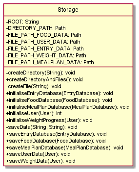

The `Storage` component consists of:

- `Path` variables and `ROOT` that determines the location of the text files.
- `createDirectory()`: Creates a directory at the specified location.
- `createDirectoryAndFiles()`: Creates the necessary directory and text files for `Storage`.
- `createFile()`: Creates a text file at the specified location.
- `initialiseEntryDatabase()`: Initialises the `EntryDatabase` by preloading data from file.
- `initialiseFoodDatabase()`: Initialises the `FoodDatabase` by preloading data from file.
- `initialiseMealPlanDatabase()`: Initialises the `MealPlanDatabase` by preloading data from file.
- `initialiseUser()`:  Initialises `User` data from file.
- `initialiseWeightProgress()`: Initialises weight progress data from file.
- `saveData()`: Saves data to a specified file.
- `saveEntryDatabase()`: Saves all the `EntryDatabase` data to file.
- `saveFoodDatabase()`: Saves all the `FoodDatabase` data to file.
- `saveMealPlanDatabase()`: Saves all the `MealPlanDatabase` data to file.
- `saveUserData()`: Saves all the `User` data to file.
- `saveWeightData()`: Saves all weight data to file.

#### Storage format (in the text files)

**Every line in each text file represents one food / entry / record**

* FoodDatabase (`food.txt`): `FOODNAME | CALORIE_VALUE | FOOD_TYPE`  
    Example: 
    ```
    fried rice | 400 | MEAL
    ramen | 500 | MEAL
    ```
* EntryDatabase (`entry.txt`): `MEALTYPE | FOODNAME | CALORIE_VALUE | DATE | FOOD_TYPE`  
    Example: 
    ```
    Lunch | fried rice | 400 | 2021-11-06 | MEAL
    Dinner | ramen | 500 | 2021-11-06 | MEAL

    ```
* User (`user.txt`): `CALORIE_GOAL | GENDER | AGE | HEIGHT | WEIGHT`  
    Example: 
    ```
    2503 | m | 21 | 184 | 75.0
    ```
* User weight (`weight.txt`): `WEIGHT | DATE`  
    Example: 
    ```
    75.0 | 2021-11-05
    75.5 | 2021-11-06
    ```
> **_NOTE:_** Example of `mealplan.txt` is omitted because its format is largely similar to `food.txt`

#### Sequence of operations

1. **Saving to text file**

`FoodDatabase`, `EntryDatabase`, and `User` classes each have a method to convert its data to String format. 
This String is then saved to the text file. For instance, when saving the `FoodDatabase` data, `Storage` 
calls the `convertDatabaseToString()` method to obtain the String representation of all the data within the 
`FoodDatabase`. This String is then written to the text file.

The following sequence diagram describes the operation of the `saveFoodDatabase()` operation.  
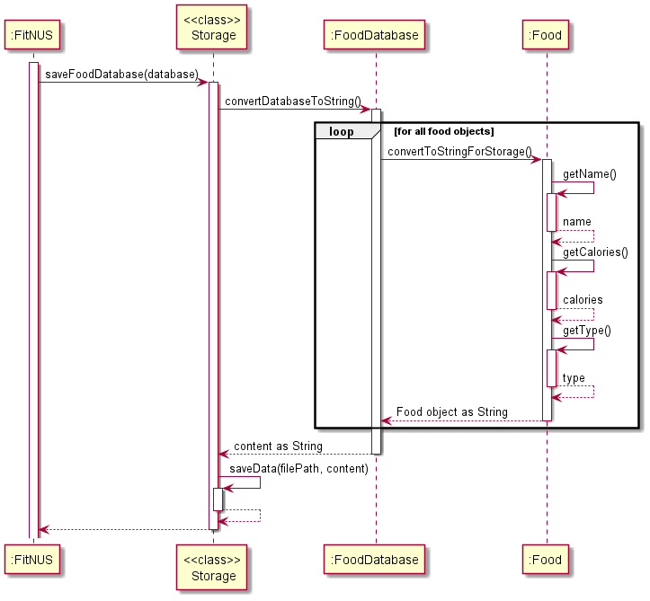

2. **Loading from text file**

`Storage` makes use of the `BufferedReader` and `FileInputStream` provided by `java.io` to access the 
contents of the storage text files. This is then passed to the respective objects for preloading.  
For instance, when preloading the `FoodDatabase` data, `Storage` accesses the storage text file and 
passes the file contents to the `preLoadDatabase()` method in `FoodDatabase` which populates the 
ArrayList in `FoodDatabase`.

The following sequence diagram describes the operation of the `initialiseFoodDatabase()` operation.  
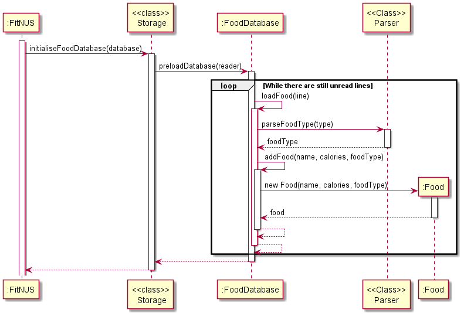


#### Design considerations

1. The `Path` of each text file is hardcoded within the `Storage` class. This eliminates
the need to pass the `Path` of the destination file each time. For example, to save the `FoodDatabase`
contents, the method call is `saveFoodDatabase()` rather than `saveFoodDatabase(PATH)`.
2. All public methods are declared as `static` methods. This allows various methods within the
`Storage` class to be called without having to instantiate a `Storage` object.

---

### Parser

The parser component makes use of the user input String from the `FitNus` class to detect the type of `Command` object called. It then returns a `Command` object that represents the type of command called through the input.

##### Identifying type of method called

  The `Parser` is invoked through the `parseCommandType()` method. The input is first split up by identifying a space character.
  If no space character is detected, and the `help` or `exit` method was not called, a `FitNusException` is thrown. The first string element is then compared with default list of commands to determine the type of method called using if-else statements.

#### How it works


- `parseAddFoodCommand(input, fd, mealTypeString)`

    `parseAddFoodCommand` checks whether the user is calling to add a new `Food` or a `MealPlan` and returns the corresponding `parseAddMealPlanFoodCommand` or `parseAddFoodCommand` methods. 
This decision is done via a simple if-else check as shown in the code snippet below. `DESCRIPTOR_MEALPLAN` is defined as the String `"/mealplan"`. 

     ```
    if (mealTypeString.equals(DESCRIPTOR_MEALPLAN)) {
    return parseAddMealPlanFoodCommand(md, input);
    } else {
    return parseAddFoodCommand(input, fd, mealTypeString);
    }
    ```

- `parseAddFoodCommand(input, fd, mealTypeString)`

    - `parseAddFoodCommand` returns a `AddFoodEntryCommand` object when called. The method first finds the `MealType` of the food by calling the `parseMealType` command.  
    - The food name input by the user is then compared to the `FoodDatabase` and `tempDbFoods`, an ArrayList containing matching Food objects, is displayed
    - If there are no matching food, a new food object will be created. `returnUserInput` will be returned and the user will be directly prompted to enter the calories and meal type of the new food.
    - If there are matching foods, `returnUserInput` will be returned and the user will be  prompted to choose the food from the matching list. 

> ⚠️ Notes about matching foods:
>- The user is allowed to create a new `Food` object when being prompted to selected matching foods. However, the scenario has not been displayed below for the sake of clarity.


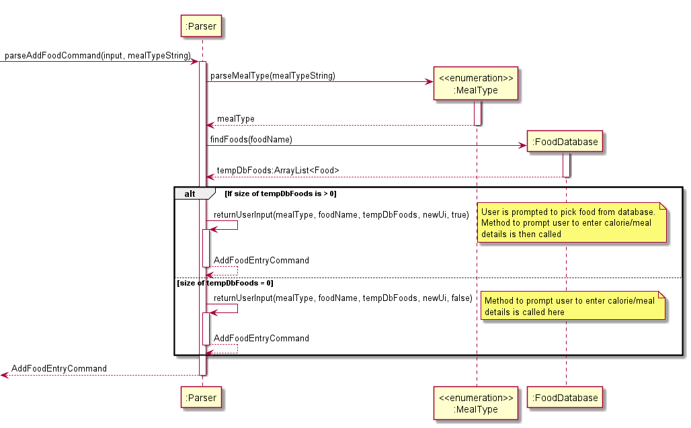


- `parseCreateCommand(input, fd)`

    - `parseCreateCommand` creates custom meal plans when called. The method is responsible for handling all meal plan creation requests.
    - The method calls the `readIndexesInput` from the `Ui` class and returns an ArrayList of inputs.
    - For each valid input, the relevant Food object from the `FoodDatabase` is extracted and stored in a temporary list of Food items.
    - Once all inputs have been parsed, a `CreateMealPlanCommand` is returned.

> ⚠️ Notes about inputs:
>-  All non-integer inputs and inputs outside the range of the database will be ignored.
> 


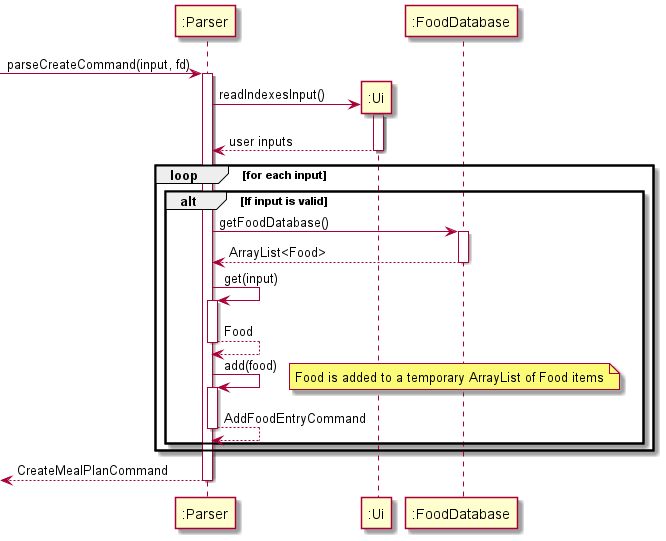


- `promptUserCalories(index, mealType, foodName, newUi)`
  - `promptUserCalories` prompts the user for extra inputs when called.
  - The method uses 2 do-while loops to receive inputs for calories and foodType variables as shown below. An internal boolean flag, `isLoopFlagOn`, is used to handle the loop logic. The flag is set to true until a valid calorie input is entered.
  ```
    do {
        userInput = parseInteger(newUi.readInput(System.in, System.out)); //getting calories
    } while (isLoopFlagOn);

    ```

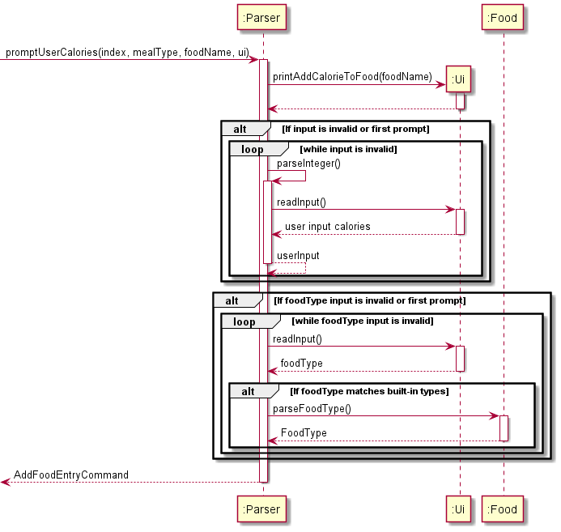


## Implementation

#### Add Food Entry Feature

The add food entry mechanism is facilitated by `AddFoodEntryCommand`. It extends `Command` and stores the data internally into `EntryDatabase` and `FoodDatabase`.

Additionally, it implements the following operations:
- `EntryDatabase#addEntry(Entry)` -- Adds a new entry into the entry database
- `FoodDatabase#addFood` -- Adds a new food into the food database

Given below is an example usage scenario and how the add food entry mechanism behaves at each step.

1. The user executes the `add soft boiled eggs` command to add a food entry to the Entry Database. 
2. Since the meal type was not specified, the `Parser` will automatically select the meal type based on the current timing.
3. The `add` command calls `AddFoodEntryCommand#execute()`, which checks whether the specified food, "soft boiled eggs",
exists in the current Food Database. 
4. Assuming there are no such food found in the Food Database, the user will be prompted to add "soft boiled eggs" as a 
new custom food. The user then inputs the relevant details required to add the new food. 
5. `AddFoodEntryCommand#execute()` will create a new Food object which corresponds to the specified food. It then calls
both `EntryDatabase#addEntry(Entry)` and `FoodDatabase#addFood()` and passes in the newly created food into these methods 
to add "soft boiled eggs" to both the Entry Database and Food Database.

The following Sequence Diagram shows how the add food entry feature works:


#### Edit Food Entry Feature

The edit food entry mechanism is facilitated by `EditFoodEntryCommand`. It extends `Command` and stores the data internally into `EntryDatabase` and `FoodDatabase`.

Additionally, it implements the following operations:
- `EntryDatabase#editEntryAtIndex(int, Entry)` -- Edits the entry at the specified index of the entry database
- `FoodDatabase#addFood` -- Adds a new food into the food database

Given below is an example usage scenario and how the edit food entry mechanism behaves at each step.

1. The user executes the `edit 1 chicken cutlet` command to edit the first entry's food to "chicken cutlet".
2. The `edit` command calls `EditFoodEntryCommand#execute()`, which checks whether the specified food, "chicken cutlet",
   exists in the current Food Database. In this case, fortunately, there were multiple foods that were found in FitNUS's 
Food Database. 
3. The user is then prompted to select one of the foods found in the Food Database, the user then selects the first option, 
"salted egg chicken cutlet".
4. `EditFoodEntryCommand#execute()` calls `EntryDatabase#editEntryAtIndex(int, Entry)` which proceeds to change the food
at the first entry to "salted egg chicken cutlet".

The following Sequence Diagram shows how the edit food entry feature works:


#### List Food Entry Feature

The list food entry mechanism is facilitated by `ListFoodEntryAllCommand`, `ListFoodEntryDayCommand`, `ListFoodEntryWeekCommand`. They extend `Command`.

Additionally, they implement the following operations:
- `EntryDatabase#listEntries()` -- Lists all entries within the entry database
- `EntryDatabase#getPastDaysEntryDatabase(int)` -- returns a subset of the original entry database containing only entries of the past specified days

Given below is an example usage scenario and how the list food entry mechanism behaves at each step.

1. The user executes the `list /entry /week` command to list out all entries in the past week. 
2. This calls `ListFoodEntryWeekCommand#execute()`, which creates a temporary EntryDatabase by calling
`EntryDatabase#getPastDaysEntryDatabase(int)` with '7' as its parameter (Since there are 7 days a week).
3. `EntryDatabase#getPastDaysEntryDatabase(int)` then returns a EntryDatabase with entries of the past 7 days.
4. With the new temporary EntryDatabase, `EntryDatabase#listEntries()` then displays the past week's entries
to the user.

The following Sequence Diagrams shows how the list food entry feature works:


#### Delete Food Entry Feature

The delete food entry mechanism is facilitated by `DeleteEntryCommand` It extends `Command` and stores the data internally into `EntryDatabase` and `FoodDatabase`.

Additionally, they implement the following operations:
- `EntryDatabase#deleteEntry(int)` -- Deletes the entry at the specified index from EntryDatabase.

Given below is an example usage scenario and how the delete food entry mechanism behaves at each step.

1. The user executes the `delete /entry 2` command to delete the second entry from the EntryDatabase.
2. This calls `DeleteEntryCommand#execute()`, which then calls `EntryDatabase#deleteEntry(int)` with '2' as its parameter
   (Since the user wishes to delete the second entry).
3. `EntryDatabase#deleteEntry(int)` simply deletes the respective entry from the EntryDatabase.


### View Food Suggestions
#### This feature allows users to find food suggestions based on food type and calorie goal.

The sequence diagram below describes the execution of the `ViewSuggestionsCommand`.


Here are the general steps taken when the `ViewSuggestionsCommand` is executed.
1. The `ViewSuggestionsCommand` obtains the user's calorie goal (`calorieGoal`) from the `user` object
   and current calorie consumption (`caloriesConsumed`) from the `entryDatabase` object.
2. The remaining calories for the day is calculated by `calorieGoal - caloriesConsumed`.
3. `findSuggestions()` method from `foodDatabase` is called to filter out all matching `Food` objects
   based on the remaining calories and specified type. The user also has the option to have the result sorted
   in ascending order of calories. This is indicated by the boolean `isSort` variable.
4. The returned ArrayList of matching `Food` objects is passed to `Ui` to be printed to the user.


## Instructions for manual testing

### User Profile Setup and Editing

This feature allows the user to set up and
edit various attributes of their user profile such as their
gender, height, weight, age and daily calorie goal.
Given below is an example usage scenario and
how the user profile setup and editing
mechanism behaves at each step respectively.

#### User Profile Setup

1. The user launches the application, causing `FitNUS#initialiseFitNUS`
to be called. Since this is the first time the user is using the app,
the `user.txt` file containing the user data does not exist yet,
prompting FitNUS to create an empty text file storing the user data
(user.txt). 

2. Since the text file is empty, the check for whether
the user data in the storage is valid returns false, causing FitNUS to
begin the user profile setup process.

    > ⚠️ Note: If `user.txt` is not empty but the user data is
    in an invalid or incomplete format, 
    the user profile setup process is continued. 

3. FitNUS begins the gender setting process by calling 
`FitNUS#initialiseAttribute` for the gender. This prompts the user to 
enter the character indicating their gender. 
The entered character is appended to a string 
"gender /set " (eg if the user entered "m", the string becomes
 "gender /set m"). This string is passed into `Parser#parseCommandType`.

4. If the user input for the character indicating the gender is valid,
`Parser#parseCommandType` returns the corresponding `SetGenderCommand` object.
The `execute` method of the `SetGenderCommand` object is called, which
sets the `gender` attribute of the `User` object. This terminates the 
gender initialisation process.

5. If any `FitNUSException` was thrown in steps 4 and 5 due to invalid user
input, steps 4 and 5 are repeated until no exception is thrown (i.e. valid
user input was received).

6. Steps 3 to 6 are repeated for `age`, `height` and `weight` attributes.

7. A daily calorie goal that allows the user to maintain their current weight
is generated by calling `User#calculateCalorieGoal`
and the `calorieGoal` attribute is set to the generated goal. 

The following sequence diagram shows how the user profile setup feature works:

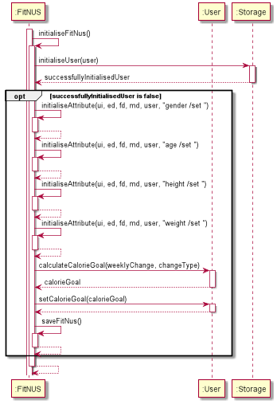

#### User Profile Editing
> ⚠️ Note: This feature only applies to setting gender, age, height and calorie goal.
> The implementation for setting weight is different as when the weight is set, the
> weight tracker is updated concurrently.

1. The user executes the `height /set 180` command to set their height to 180cm. 
`SetHeightCommand#execute` is called, which sets the `height` attribute
of the `User` object to 180 by calling `User#setHeight`.

The following sequence diagram shows how the user profile editing feature works
for the example of setting height:

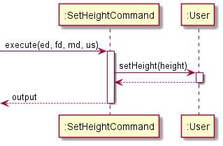

### List User Data
This feature lists all the user's data (i.e. gender, age, height, weight 
and daily calorie goal). Given below is an example usage scenario and
how its mechanism behaves at each step.

1. The user executes the `list /user` command to
   list their data. `ListUserDataCommand#execute` is called,
   which calls `User#getUserDataDisplay` and displays the returned user data.

The following sequence diagram shows how the list user data feature works:

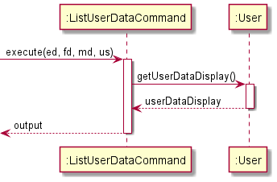

### Record Weight

This feature allows the user to record their weight for the day in the
weight tracker and also update their weight in their user profile.
Given below is an example usage scenario and
how its mechanism behaves at each step.

1. The user executes the `weight /set 65.5` command to set their weight to 65.5 kg.
`SetWeightCommand#execute` is called, which calls `User#updateWeightAndWeightTracker`.
2. The `weight` attribute of the `User` object is set to 65.5.
3. If a weight record for the current day already exists in the weight tracker,
that record is replaced with another record with the updated weight. Otherwise, a
new weight record with the updated weight is created and added to the weight tracker.

The following sequence diagram shows how the weight recording feature works:

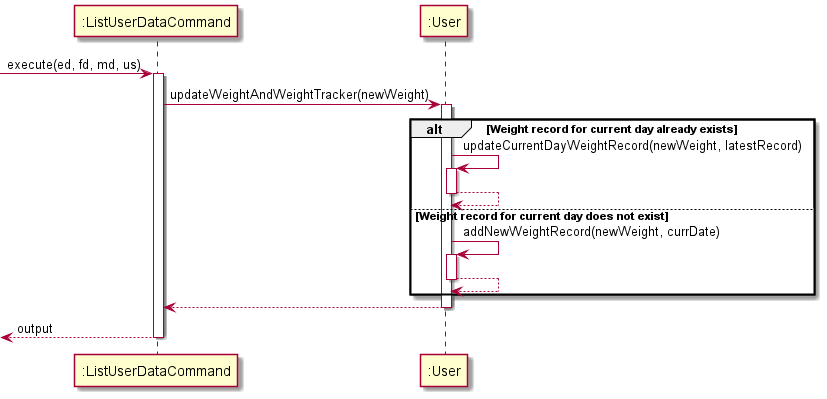

### List Weight Tracker

This feature allows the user to list the weight tracker data in a particular month
or since the start of using the app.
Given below is an example usage scenario and
how its mechanism behaves at each step.

1. The user executes the `list /weight /month 1` command to list all weight tracker 
data in January (in the current year). `ListWeightProgressCommand#execute` is called, 
which calls `User#getWeightTrackerDisplay`.
2. `User#getRelevantWeightRecords` is called to get all weight records in January in
the current year. If there is more than one weight record, the difference between the 
weight in the earliest record and the latest record is calculated.
3. The weight tracker is displayed, showing weight records and the calculated weight
change in January.

The following sequence diagram shows how the list weight tracker feature works:

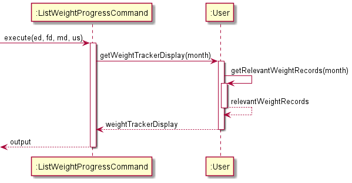


### Generate Calorie Goal

This feature allows the user to generate a daily calorie goal
according to their body type and their desired weekly weight change
and set that as their daily goal.
Given below is an example usage scenario and
how its mechanism behaves at each step.

1. The user executes the `calorie /generate /lose 0.1` command to 
generate a calorie goal that allows them to lose 0.1 kg per week
and set that as their daily goal. `GenerateCalorieGoalCommand#execute` is called, 
which calls `User#handleGenerateCalorieGoalCommand`. 
2. If no exceptions were thrown, `User#calculateCalorieGoal` is called, which 
calculates the calorie goal accordingly and returns it.
3. `User#setCalorieGoal` is called to set the user's calorie goal to the generated
goal.

The following sequence diagram shows how the generate calorie goal feature works:

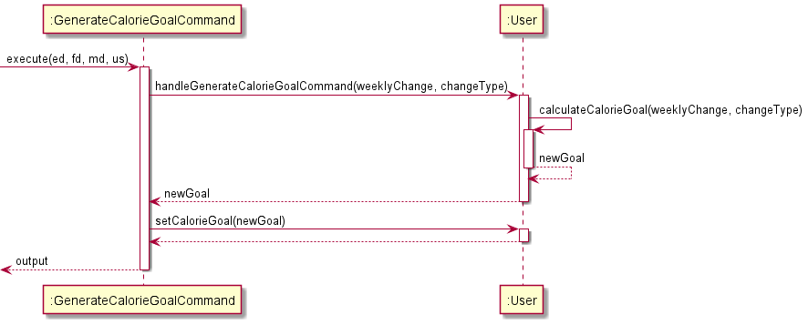

### View Remaining Calories

This feature allows the user to view how many calories they have remaining
for the day before they hit their daily calorie goal. 
Given below is an example usage scenario and
how its mechanism behaves at each step.

1. The user executes the `calorie /remain` command to view their remaining calories
for the day. `ViewRemainingCalorieCommand#execute` is called, which calls `User#getCaloriesRemaining`.
2. `EntryDatabase#getTotalDailyCalorie` is then called, which adds up the calories of all
entries in the food tracker. This is subtracted from the user's daily calorie goal. 
The resulting calories remaining is then displayed to the user. 

The following sequence diagram shows how the view remaining calories feature works:

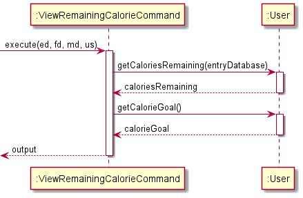


# Instructions for manual testing

### Launch and shutdown
//todo

-------------

## Entry Features

### Add Food Entry

**Add from existing database**

1. Test case: `add /bfast chicken cutlet`

    Expected: User to be able to choose from a list of food from the existing database which includes "chicken cutlet",
    after which, a new food entry should be added as a Breakfast.
2. Other incorrect commands to try:
   - `add /teabreak chicken rice`(should use one of the available meal types)

**Add a custom food entry**

1. Test case: `add /snack vanilla ice-cream`

    Expected: User to be able to add a new food entry "vanilla ice-cream" since it does not exist in the existing 
database. Resulting in a new food entry being added as a Snack.

### Edit Food Entry

1. Prerequisite: User must have **1 or more** existing food entries
2. Test case: `edit 1 chicken rice`

    Expected: User to be able to choose from a list of food from existing database to edit the first entry to.
3. Other incorrect commands to try:
    - `edit 0 laksa`(should use a valid index)

### List Food Entry

**List entries for the day**
1. Prerequisite: User should have **1 or more** existing food entries
2. Test case: `list /entry /day`

    Expected: User should be able to see all food entries that was logged in today
3. Other incorrect commands to try:
    - `list /entry year`(should use a valid timeframe)

**List entries for the past week**
1. Prerequisite: User should have **1 or more** existing food entries
2. Test case: `list /entry /week`

    Expected: User should be able to see all food entries that was logged in the past week
3. Other incorrect commands to try:
    - `list /entry year`(should use a valid timeframe)

### Delete Food Entry

1. Prerequisite: User should have **1 or more** existing food entries
2. Test case: `remove /entry 1`

    Expected: The first entry is deleted
3. Other incorrect commands to try:
    - `remove /entry -1`(should use a valid index)

### Find Food Entry
1. Prerequisite: User should have **1 or more** existing food entries consisting of the keyword "chicken"
2. Test case: `find /entry chicken`

    Expected: User should be able to see all entries consisting of the keyword "chicken"

-------------
## Food Features

### List foods
#### List all foods inside food database
1. Prerequisites: there must be at least one food inside the database
2. Test case: `list /food`

   Expected: returns all the foods inside the food database.

### Delete food
#### Delete food inside the food database at certain index.
1. Prerequisites: there must be at least one food inside the database
2. Test case: `remove /food 2`
   Expected: delete the 2nd food at the food database successfully.
3. Other incorrect commands to try:
   - `remove /food` (the index for food is mandatory)
   - `remove /food a` (the index is supposed to be an integer)


### Find food
#### Find food inside the food database according to keywords.
1. Prerequisites: there must be at least one food inside the database
2. Test case: `remove /food rice`
   Expected: returns all the foods inside the food database contain the keyword "rice".
3. Other incorrect commands to try:
   - `remove /food` (the keyword for searching is mandatory)

-------------
## Weight Tracker Features

### Record weight

#### Recording weight for the day
1. Prerequisites: User has not recorded their weight for the day.
2. Test case: `weight /set 65.5`

   Expected: User's weight is set to 65.5 kg, and a new weight record is added
   to the weight tracker with the current date and the recorded weight of 65.5 kg.

#### Updating weight twice in one day
1. Prerequisites: User has already recorded their weight for the day.
2. Test case: `weight /set 55.5`

   Expected: The user's weight is set to 55.5 kg, and the current day's
   weight record in the weight tracker is replaced with a new weight record with
   the updated weight of 55.5 kg.

### List weight tracker data

#### Listing all weight tracker data
1. Prerequisites: Multiple weight records in weight tracker.
2. Test case: `list /weight /all`

   Expected: All weight records in the weight tracker are listed and
   the amount of weight gained or lost since the start of using the app is shown.

#### Listing weight tracker data in a particular month in the current year
1. Prerequisites: Weight records for the month of January exist in the weight tracker.
2. Test case: `list /weight /month 1`

   Expected:  All weight records in the weight tracker that were entered during the month
   of January (in the current year) are listed, and the amount of
   weight gained or lost in January (in the current year) is shown.
3. Other incorrect `list /weight` commands to try: `list /weight`,
   `list /weight /month 13`

   Expected: Weight tracker data not shown. Error details shown in status message.

-------------
## User Personalisation Features

### Set gender

#### Setting gender
1. Test case: `gender /set m`

   Expected: The user's gender is set to Male.

### Set gender

#### Setting age
1. Test case: `age /set 18`

   Expected: The user's age is set to 18 years old.

### Set height

#### Setting height
1. Test case: `height /set 180`

   Expected: The user's height is set to 180 cm.

### Set calorie goal

#### Setting calorie goal
1. Prerequisites: The minimum/maximum calorie goal of the user (according
   to their body type) is lower/higher than 2000kcal.
2. Test case: `calorie /set 2000`

   Expected: The user's calorie goal is set to 2000kcal.

### Generate calorie goal

#### Generating calorie goal according to desired weekly change
1. Prerequisites: User profile setup has been completed (app is not
   prompting user to set up their profile).
2. Test case: `calorie /generate /lose 0.1`

   Expected: The generated calorie goal to lose 0.1 kg per week is displayed.
   The user's calorie goal is set to the newly generated goal.
3. Test case: `calorie /generate /lose 0.001`

   Expected: The user is alerted that the weekly weight change must be 0.01 kg
   or more and that the newly generated goal will allow them to maintain
   their current weight instead. The user's calorie goal is set to the newly
   generated goal.
4. Other incorrect `calorie /generate` commands to try: `calorie /generate`,
   `calorie /generate /lose invalid`

   Expected: A new calorie goal is not generated and set. Error details shown
   in status message.

### View remaining calories

#### Viewing remaining calories for the day
1. Prerequisites: The total number of calories of all food tracker entries entered
   for the day has not exceeded the user's daily calorie goal.
2. Test case: `calorie /remain`

   Expected: The remaining calories that the user can consume for the day according
   to their daily calorie goal is displayed.

#### Viewing remaining calories for the day when exceeded daily goal
1. Prerequisites: The total number of calories of all food tracker entries entered
   for the day has exceeded the user's daily calorie goal.
2. Test case: `calorie /remain`

   Expected: The number of calories the user has exceeded their daily goal by is
   displayed.

### List user data

#### Listing all user data
1. Prerequisite: User profile setup has been completed (app is not
   prompting user to set up their profile).
2. Test case: `list /user`

   Expected: User data including gender, age, height, weight and daily
   calorie goal is displayed.

-------------
## Other Features

### View statistics
#### Weekly report

This feature allows the user to generate a report that provides an overview of their diet over the past 7 days.

Prerequisite: Have at least one existing `Entry` in the past week.

1. The user executes the `summary /week` command to generate a report of their diet in the past week.
`ViewWeekSummaryCommand#execute` is called.
2. `EntryDatabase#getPastDaysEntryDatabase` is then called to retrieve all `Entry` objects from the past week.
3. A `Summary` object is then created based on the retrieved `Entry` objects.
4. `Summary#generateWeekSummaryReport` is then called which generates a report based on the food consumed 
over the past seven days.

Expected: A weekly report is generated.


#### Monthly report

This feature allows the user to generate a report that gives an overview of their diet over this past month.

Prerequisite: Have at least one existing `Entry` in the past month.

1. The user executes the `summary /month` command to generate a report of their diet in the past month.
   `ViewMonthSummaryCommand#execute` is called.
2. `EntryDatabase#getPastMonthEntryDatabase` is then called to retrieve all `Entry` objects from the past month.
3. A `Summary` object is then created based on the retrieved `Entry` objects.
4. `Summary#generateMonthSummaryReport` is then called which generates a report based on the food consumed
   over the past month.

Expected: A monthly report is generated.

### View suggestions

This feature allows the user to find `Food` suggestions based on calorie goal and specified `FoodType`. 

Prerequisite: 
- User data (gender, age, weight, height) is set correctly to ensure the calorie
goal is generated correctly
- `FoodDatabase` has at least one `Food`

Given below is an example usage scenario and how its mechanism behaves at each step.

1. The user executes the `suggest /snack` command to find suggestions for a snack.
`ViewSuggestionsCommand#execute` is called.
2. `User#getCalorieGoal` and `EntryDatabase#getTotalDailyCalorie` are then called in order to compute
the remaining calories for the day.
3. `FoodDatabase#findSuggestions` is called next to retrieve matching `Food` objects.
4. `Ui#printMatchingFoods` is then called to print all the retrieved `Food`.

Expected: Matching `Food` suggestions are shown.

-------------


## NF Requirements

1. The software should be compatible with mainstream operating systems (Windows, macOS, Linux).
2. Data of users and foods should be stored and retrieved swiftly without delay, even for a long time user with very a big data set. 
3. User's and food's data should be kept safely, and it is crashed, the program should be able to detect it.
