# User Guide

## Introduction

FitNUS Tracker is a desktop app for tracking daily food intake to maintain a healthy lifestyle. 
FitNUS has features and functionalities tailor-made just for you if you are a Computing Student
living in University Town. FitNUS is run on the Command Line Interface (CLI).

Here is the list of sections we will be covering in this User Guide.

- [Quick Start](#quick-start)
- [Features](#features)
  - [Entry Database](#entry-database)
    - [Adding food entry: `add`](#adding-food-entry-add)
    - [Adding meal plan entry: `add /mealplan`](#adding-meal-plan-entry-add-mealplan)
    - [Editing existing food entry: `edit`](#editing-existing-food-entry-edit)
    - [Deleting food entry: `remove /entry`](#deleting-food-entry-remove-entry)
    - [Listing food entries: `list /entry`](#listing-food-entries-list-entry)
    - [Searching for food entries with keyword: `find /entry`](#searching-for-food-entries-with-keyword-find-entry)
  - [Food Database](#food-database)
    - [Deleting food: `remove /food`](#deleting-food-remove-food)
    - [Searching for foods with keyword: `find /food`](#searching-for-foods-with-keyword-find-food)
    - [Listing foods in food database: `list /food`](#listing-foods-in-food-database-list-food)
  - [Meal Plan Database](#meal-plan-database)
    - [Creating new meal plan: `create /mealplan`](#creating-meal-plan-by-adding-food-create-mealplan)
    - [Listing meal plan entries: `list /mealplan`](#listing-meal-plan-entries-list-mealplan)
  - [Weight Tracker](#weight-tracker)
    - [Recording weight: `weight /set`](#recording-weight-weight-set)
    - [Listing weight records: `list /weight`](#listing-weight-records-list-weight)
  - [Personalisation](#personalisation)
    - [Setting gender: `gender /set`](#setting-gender-gender-set)
    - [Setting height: `height /set`](#setting-height-height-set)
    - [Setting age: `age /set`](#setting-age-age-set)
    - [Setting calorie goal: `calorie /set`](#setting-calorie-goal-calorie-set)
    - [Generate and set calorie goal: `calorie /generate`](#generate-and-set-calorie-goal-calorie-generate)
    - [View remaining calories for the day: `calorie /remain`](#view-remaining-calories-for-the-day-calorie-remain)
    - [View user data: `list /user`](#view-user-data-list-user)
  - [Other](#other)
    - [Viewing help: `help`](#viewing-help-help)
    - [Viewing statistics: `summary`](#view-statistics-summary)
    - [Getting food suggestions: `suggest`](#getting-food-suggestions-suggest)
    - [Saving data](#saving-data)
    - [Loading data](#loading-data)
    - [Exiting FitNUS: `exit`](#quit-fitnus)
- [User Stories](#user-stories)
- [Command Summary](#command-summary)

---
## Quick Start

1. Ensure that you have Java 11 installed in your computer. 
2. Download the latest version of `fitNus.jar` from [here](https://github.com/AY2122S1-CS2113T-W12-1/tp/releases/tag/V2.1).
3. Copy the file to the folder you want to use as the home folder for your FitNUS Tracker.
4. Type the following command in your terminal to run this program:`java -jar FitNus.jar`
5. If this is your first time using FitNUS, (i.e. users with incomplete or missing user data) 
FitNUS will prompt you to set up your user profile by filling in some details.
If you have successfully run the programme, you should see output similar to the screenshot below:

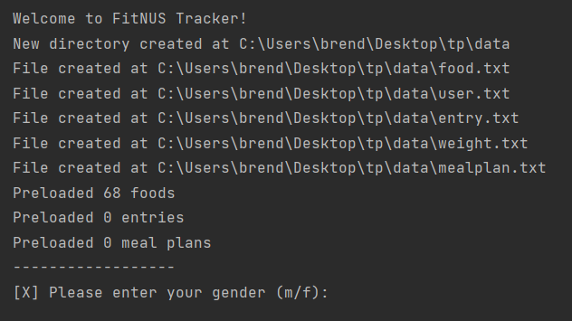

----- 

## Features
> **⚠️ Notes about command format**
> 
> - Words in **UPPER_CASE** are the parameters to be inputted by you!

>  e.g. in `add /bfast FOOD_NAME`, FOOD_NAMEx is a parameter which can be substituted as `add /bfast burgers`.
> - Items in **[Square brackets]** are optional!

>  e.g. `add [/MEALTYPE] FOOD_NAME` can be used as `add /lunch sandwiches` or `add sandwiches`.

&nbsp;

-----

### Entry Database

&nbsp;

#### Adding food entry: `add`
Adds an entry to the Entry Database. You will also be prompted to fill in any additional information if the
food you requested was not found in the food database. 

Format: `add [/MEALTYPE] FOOD_NAME`

* The `MEALTYPE` can be of the following 4 types:
  * `bfast` - to denote breakfast
  * `lunch` - to denote lunch
  * `dinner` - to denote dinner
  * `snack` - to denote snacks

> **⚠️ Notes about omitting `MEALTYPE`**
>
> - The `MEALTYPE` will be automatically added based on the current time if not explicitly specified based on the following criteria:
>  - Breakfast: 6am to 10am
>  - Lunch: 11am to 2pm
>  - Dinner: 6pm to 9pm
>  - Snack: Remaining time
> 
> - **If a backslash character ("/") is written as the first character of the food name when omitting the `MEALTYPE`, the app will reject the input!**
>
>   Eg. The input `add /rice noodles` will be rejected, whereas the input `add /bfast /rice noodles` will be accepted.

* If there are any pre-set food that matches `FOOD_NAME`, you can do one of the following:
    * Select which food you would like to add
    * Create your own custom food
    
Examples of usage: `add /bfast chocolate`

Sample output:

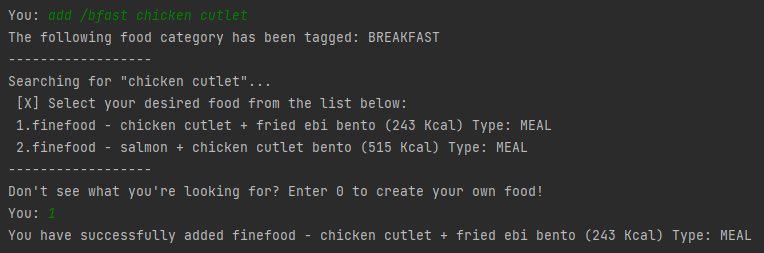

&nbsp;

#### Adding meal plan entry: `add /mealplan`
Adds a meal plan consisting of existing food items. To add a meal plan, there needs to be at least 1 meal plan inside the meal plan database. 
Click [here](#creating-meal-plan-by-adding-food-create-mealplan) 
to find our how to create a meal plan.  

Format: `add /mealplan [/MEALTYPE] INDEX_OF_MEALPLAN`

* The `MEALTYPE` can be of the following 4 types:
  * `bfast` - to denote breakfast
  * `lunch` - to denote lunch
  * `dinner` - to denote dinner
  * `snack` - to denote snacks

If a MEALTYPE is not specified, FitNus will automatically tag the meal based on the current time.

> **⚠️ Notes about `INDEX_OF_MEALPLAN`**
>
> - INDEX_OF_MEALPLAN refers to the index of the meal plan(s) shown when command `list /mealplan` is used.
>
> - INDEX_OF_MEALPLAN must be an integer value and within the range shown above.

Examples of usage: `add /mealplan /dinner 1`

Sample output:

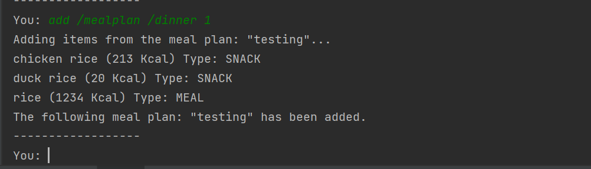

&nbsp;

#### Editing existing food entry: `edit`
Edits an existing entry's food information. FitNUS will search for FOOD_NAME in the food database 
and update the specified entry's food details accordingly.

Format: `edit INDEX_OF_ENTRY FOOD_NAME`
> **⚠️ Notes about `INDEX_OF_ENTRY`**
>
> INDEX_OF_ENTRY refers to the index of the entry shown when command `list /entry` is used.

* If there are any pre-set food that matches `FOOD_NAME`, you can do one of the following:
    * Select which food you would like to add
    * Create your own custom food

Example of usage:
`edit 1 chicken`

Sample output:

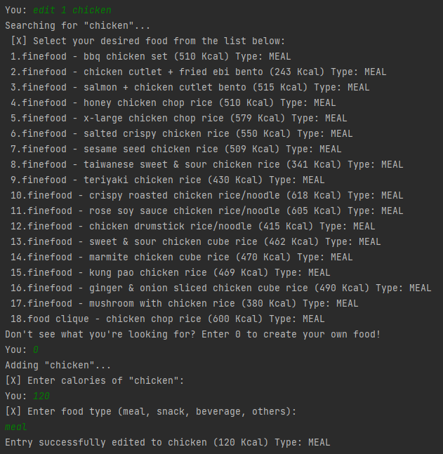

&nbsp;

#### Deleting food entry: `remove /entry`
Deletes an entry from the Entry Database.

Format: `remove /entry INDEX_OF_FOOD`

Example of usage:

`remove /entry 1`

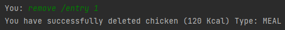

&nbsp;

#### Listing food entries: `list /entry`
Lists out all food entries for a given timeframe.

Format: `list /entry [/TIMEFRAME]`
* The `TIMEFRAME` can be of the following 2 types:
  * `day` - to show entries in the current day
  * `week` - to show entries in the past week

> **⚠️ Notes about omitting `TIMEFRAME`**
>
> Command will list out **ALL** available food entries.

Example of usage:
`list /entry /week`

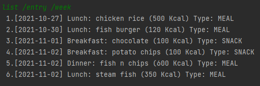

&nbsp;

#### Searching for food entries with keyword: `find /entry`
Finds all matching entries in the Entry Database based on the keyword you provided.

Format: `find /entry KEYWORD`

Example of usage:

`find /entry chicken`

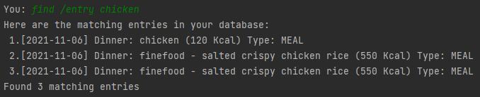

&nbsp;

----

### Food Database

&nbsp;

#### Deleting food: `remove /food`

Deletes a specified food from the Food Database.

Format: `remove /food INDEX_OF_FOOD`

Example of usage: `remove /food 12`

Sample output:

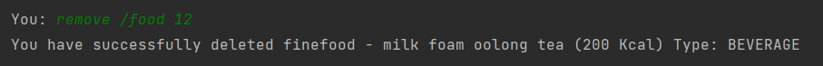

&nbsp;

#### Searching for foods with keyword: `find /food`

Finds all matching foods in the Food Database based on the keyword you provided.

Format: `find /food KEYWORD`

Example of usage: `find /food ramen`

Sample output:

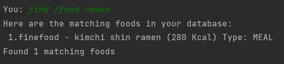

&nbsp;

#### Listing foods in food database: `list /food`

Lists out all foods in the Food Database.

Format: `list /food`

Example of usage: `list /food`

Sample output:

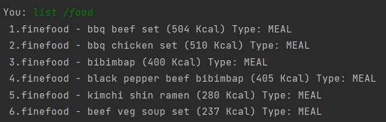

&nbsp;

---- 

### Meal Plan Database

&nbsp;

#### Creating meal plan by adding food: `create /mealplan`
Creates a custom meal plan by adding existing food items inside the food database to the meal plan. A meal plan consists of a name, and a list of Food items. 
In order to create a meal plan, you must add at least 1 food item to the plan. 

Format: `create /mealplan NAME_OF_MEALPLAN`

Once a valid `NAME_OF_MEALPLAN` has been added, you will be shown a list of food inside the database and will be prompted to input the indexes of the foods you want to include inside the meal plan. A visual walkthrough has been shown below.

> **⚠️ Notes about `NAME_OF_MEALPLAN`**
>
> `NAME_OF_MEALPLAN` must be at least 1 character in length. 
> Pipe Characters ("|") will be automatically be removed if included.

> **⚠️ Notes about adding food items to meal plan**
>
> Only valid indexes entered will be parsed. The `index` MUST be an integer value and within the range of food items displayed. Invalid indexes will be ignored as shown below.

**Examples of usage:**

**Example 1 - All input indexes are valid**

Input 1: `create /mealplan dinner plan`

Input 2: `1 4 5` 

Sample output:

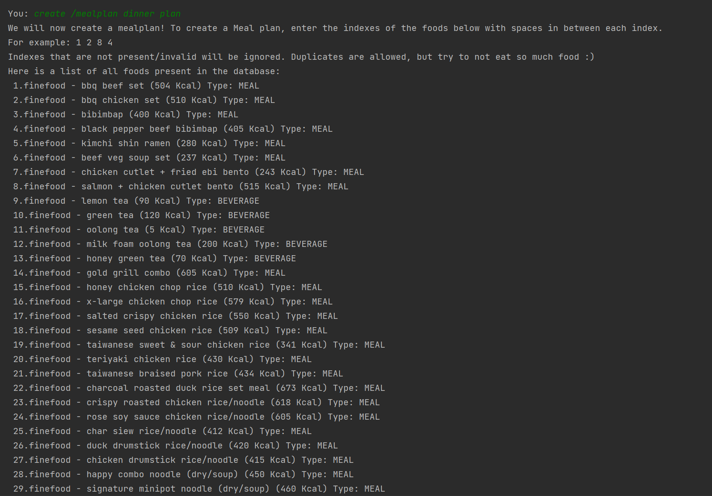

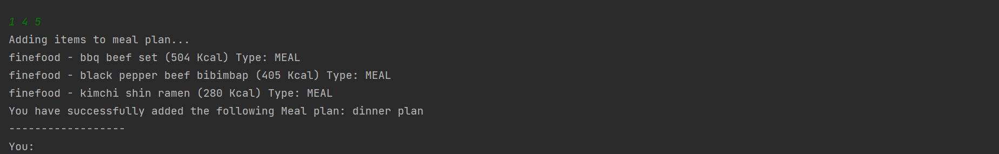

**Example 2 - Some input indexes are invalid**

Input 1: `create /mealplan supper plan`

Input 2: `1 89 abc` 

- Input index `89` is not valid as it is outside the range of the food database.
- Input `abc` is not valid as it is not an integer.

Sample output:

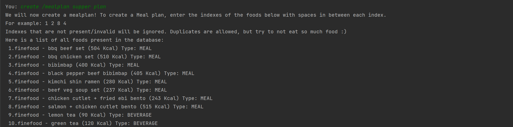

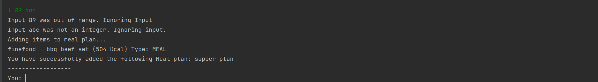

**Example 3 - All input indexes are invalid**

Input 1: `create /mealplan supper plan`

Input 2: `blah -100`

- Input `blah` is not valid as it is not an integer.
- Input index `-100` is not valid as it is outside the range of the food database.

Sample output:

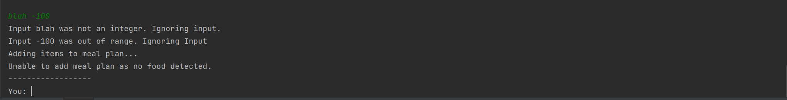

> **⚠️ Notes about duplicate meal plans**
>
> Duplicate meal plans are allowed as restricting either the name or the food added to a meal plan would not improve the usability of the app.

&nbsp;

#### Listing meal plan entries: `list /mealplan`
Lists out all meal plans entered. Each individual meal plan along with its associated food items are listed as shown below.

Format: `list /mealplan`

**Example of usage:**

`list /mealplan`

Sample output: 

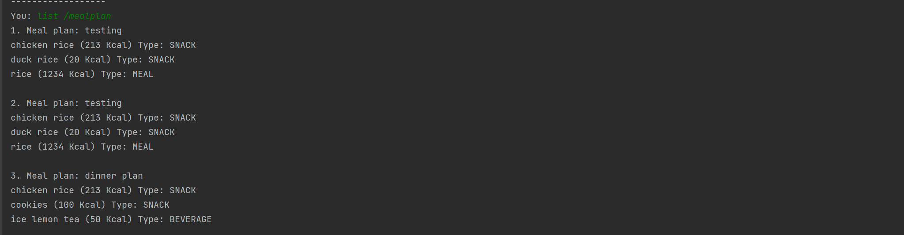

&nbsp;

---- 

### Weight Tracker

#### Recording weight: `weight /set`
Updates your current weight as well as 
your weight record for the day in the weight tracker.

Format: `weight /set WEIGHT`

- `WEIGHT` is a positive number with 1 decimal place and cannot be above 500.0

> **⚠️ Notes about recording weight**
>- If you have already recorded your weight for the day, recording the weight again
  will override the previous weight record for the day instead of creating a new record.
>- If `WEIGHT` is entered as a number with more than 1 decimal place, the trailing decimals
> will be cut off (no rounding will take place).

Example of usage:

`weight /set 55.6`

Sample Output:

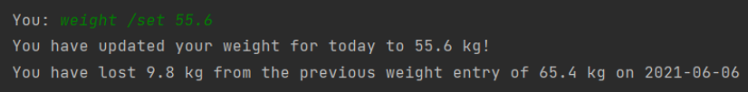

&nbsp;

#### Listing weight records: `list /weight`
Lists weight records within a certain timeframe (either 
all weight records from when the user started using the app
or weight records in a particular month in 
the current year). 

Format:
`list /weight /all` OR `list /weight /month MONTH_INTEGER`

- `MONTH_INTEGER` refers to the integer representation of a particular month.
  (e.g. 1 represents January, 2 represents February etc.)

Examples of usage:

1. List weight progress since the start of using FitNus: `list /weight /all`
   - Sample Output:
   
    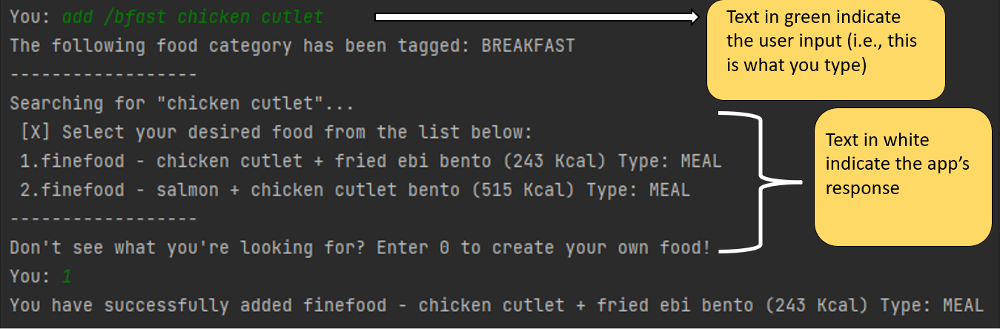

2. List weight progress in a certain month in the current year: `list /weight /month 3`
   - Sample Output:
   
   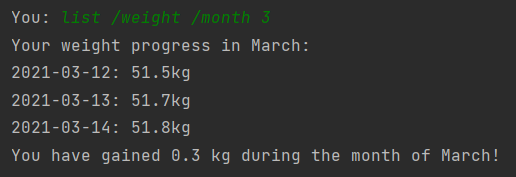

&nbsp;

---- 

### Personalisation

&nbsp;

####  Setting gender: `gender /set`
Sets your gender to either Male or Female.

Format: `gender /set GENDER_SYMBOL`
- The `GENDER_SYMBOL` can be of the following 2 types:
  - `M` or `m` - denotes Male 
  - `F` or `f` - denotes Female

Example of usage: `gender /set m`

Sample Output:

&nbsp;

####  Setting height: `height /set`
Sets your height in centimeters.

Format: `height /set HEIGHT`
- `HEIGHT` is an integer between 40 and 300

Example of usage:`height /set 180`

Sample Output:

&nbsp;

####  Setting age: `age /set`
Sets your age in years.

Format: `age /set AGE`
- `AGE` is an integer between 12 and 100

Example of usage:`age /set 18`

Sample Output:

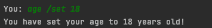

&nbsp;

####  Setting calorie goal: `calorie /set`
Sets your calorie goal in kcal.

Format: `calorie /set CALORIE_GOAL`

> **⚠️ Notes about setting calorie goal**
> - FitNUS calculates the minimum and maximum calorie goal
    (according to your height,
  weight, gender and age) that is within the recommended healthy amount of weight loss or gain
  per week. You cannot set a goal that is not within the healthy range of daily calorie
  intake for your body type.

Example of usage:`calorie /set 2000`

Sample Output:

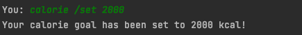

&nbsp;

####  Generate and set calorie goal: `calorie /generate`
Generates and sets a calorie goal based on your
target weight loss/gain per week, age, height, 
weight and gender using the Harris-Benedict equation.

Format: `calorie /generate /CHANGE_TYPE WEEKLY_CHANGE_IN_KG`

* `CHANGE_TYPE` can be of the following 2 types: 
  * `lose` - denotes aiming to lose weight
  * `gain` - denotes aiming to gain weight
* `WEEKLY_CHANGE_IN_KG` is a number between 0.01 and 1.0

> **⚠️ Notes about calorie goal generation**
>
> * The weekly change must be less than 1.0 kg 
> according to the recommended amount of weight that can be 
> lost or gained per week in a safe and healthy manner. 
> * If the weekly change entered is less than 0.01 kg, 
> it will be treated as a negligible weekly change and instead generate 
> a goal that allows you to maintain your current weight.

Example of usage:`calorie /generate /gain 0.5`

Sample Output:

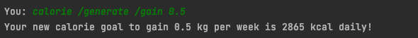

&nbsp;

#### View remaining calories for the day: `calorie /remain`
Shows the remaining number of calories you can consume for the day to stay
within your daily calorie goal.

Format: `calorie /remain`

Sample Output:

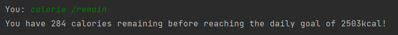

&nbsp;

#### View user data: `list /user`
View your personal user data including gender, age, weight, height and calorie goal.

Format: `list /user`

Sample Output:

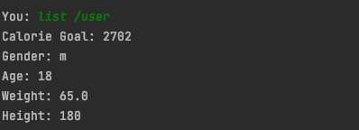

&nbsp;

-----

### Other

&nbsp;

#### Viewing Help: `help`
Lists out available commands and additional information regarding each command.

Format: `help`

Sample Output:

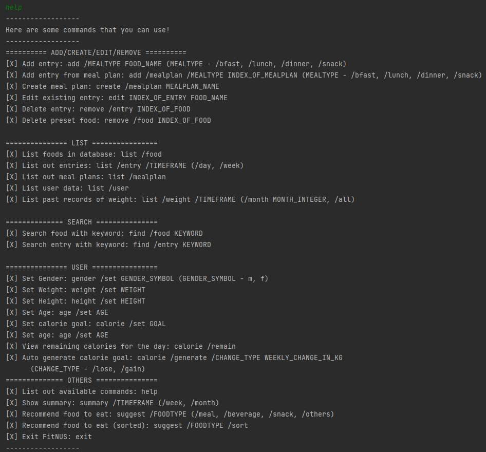

&nbsp;

#### View statistics: `summary`
FitNUS supports two kinds of diet reports:

##### Weekly report
Weekly report gives you an overview of your diet over the past 7 days, which includes:
- Graph of daily calorie intake
- Average calorie intake
- Most frequently eaten foods
- Least frequently eaten foods

Format: `summary /week`

Sample Output:

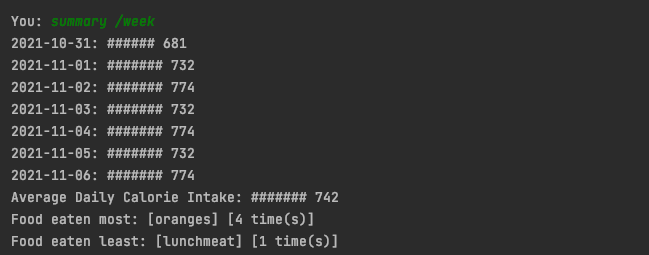

&nbsp;

##### Monthly report
Monthly report gives you an overview of your diet over the current month, which includes:
- Average calorie intake
- Most frequently eaten foods
- Least frequently eaten foods

Format: `summary /month`

Sample Output:

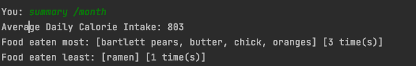

&nbsp;

#### Getting food suggestions: `suggest`
Provides food suggestions for you by filtering food items in the database based on food type 
(meal, snack, beverage, others) that if consumed, will not exceed the daily calorie goal.

Format: `suggest /FOODTYPE [/sort]`

> **_NOTE:_** FOODTYPE is one of: `meal` / `snack` / `beverage` / `others`

> **_NOTE:_** Appending `/sort` will sort the suggestions by calorie value in
> ascending order (optional)

Example of usage: `suggest /meal` `suggest /snack /sort`

Sample output:

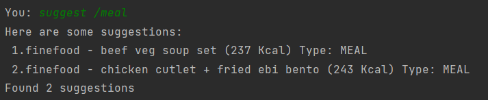

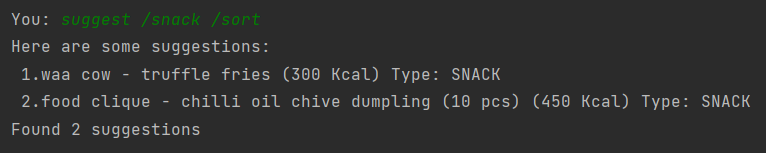

&nbsp;

#### Saving data

Application data is saved whenever any data is added or modified. 
This process is automatic, so no user input is needed for this.

&nbsp;

#### Loading data

Application data is automatically loaded from text files within the data folder upon startup. 

If data is successfully loaded upon startup, you will see messages similar to the following:

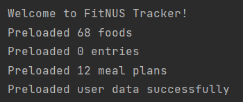

However, if files are missing, FitNus will create the necessary files for you.
Then, you will see messages similar to the following:

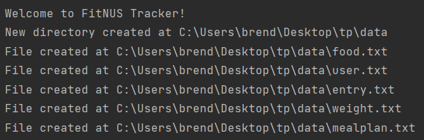

&nbsp;

#### Quit FitNus
Exits the FitNus program.

Format: `exit`

Sample Output:

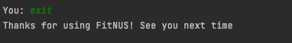

&nbsp;

----- 

## User Stories

| As a... | I can...                                 | So that I can...                                                    |
|---------|------------------------------------------|---------------------------------------------------------------------|
| User    | input entries every time I eat something | incorporate it seamlessly into my daily life                        |
| User    | edit my entries                          | make changes to my food entries at a later time                     |
| User    | delete entries in case I mistype         | -                                                                   |
| User    | list all my entries                      | look back at what I ate in the past                                 |
| User    | search food by a keyword                 | easily look for the food that I ate                                 |
| User    | create meal plans                        | add multiple food entries at once                                   |
| User    | record my current weight                 | look back and keep track of my weight in the future                 |
| User    | list out previous weight records         | look at my progress of weight loss/gain                             |
| User    | set my gender/height/age                 | get a more accurate calorie goal when using FitNUS                  |
| User    | set my calorie goal                      | have a fixed objective for my calorie intake                              |
| User    | generate my calorie goal                 | find out the optimal calorie intake to lose/gain  my desired weight |
| User    | list my user details                     | see my current user details at a glance                             |
| User    | show a summary of my past food intake    | easily see how much I have eaten and what I have  eaten at a glance |
| User    | ask for help                             | see all the available commands at a glance                          |
| User    | ask for food suggestions                 | get recommendations of food to eat based on my calorie intake       |
| User    | exit FitNUS                              | -                                                                   |

----- 

## Command summary

Action | Command Format | Example
--- | --- | --- | 
Add food| add /MEALTYPE FOOD_NAME | `add /bfast chocolate rolls`
Add meal plan| add /mealplan /MEALTYPE MEALPLAN_INDEX | `add /mealplan /bfast 1`
Create meal plan| create /mealplan MEALPLAN_NAME | `create /mealplan bulking`
Edit | edit INDEX_OF_FOOD FOOD_NAME | `edit 1 burger`
Remove entry | remove /entry INDEX_OF_FOOD | `remove /entry 2`
Remove food | remove /food INDEX_OF_FOOD | `remove /food 12`
Find food | find /food KEYWORD | `find /food rice`
Find entry | find /entry KEYWORD | `find /entry rice`
List food | list /food | `list /food`
List meal plan | list /mealplan | `list /mealplan`
List all entries | list /entry | `list /entry`
List daily entry | list /entry | `list /entry /day`
List weekly entry | list /entry | `list /entry /week`
List weight record | list /weight /all   list /weight /month MONTH_INTEGER | `list /weight /all`   `list /weight /month 1`
List user data | list /user | `list /user`
Set gender | gender /set GENDER | `gender /set m`
Set age | age /set AGE | `age /set 18`
Set height | height /set HEIGHT | `height /set 180`
Set and record weight | weight /set WEIGHT | `weight /set 65.5`
Set calorie goal | calorie /set CALORIE_GOAL | `calorie /set 2000`
Generate calorie goal | calorie /generate /CHANGE_TYPE WEEKLY_CHANGE_IN_KG | `calorie /generate /lose 0.1`
View remaining calories | calorie /remain | `calorie /remain`
View weekly statistics | summary /week | `summary /week`
View monthly statistics | summary /month | `summary /month`
Suggest food | suggest /FOODTYPE   suggest /FOODTYPE /sort | `suggest /meal`   `suggest /snack /sort`
Exit the program | exit |

