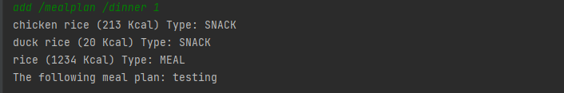
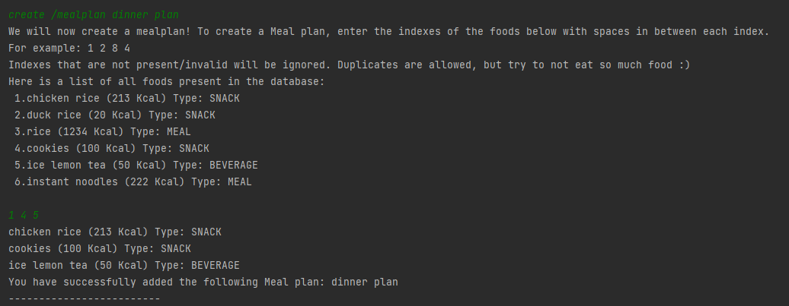
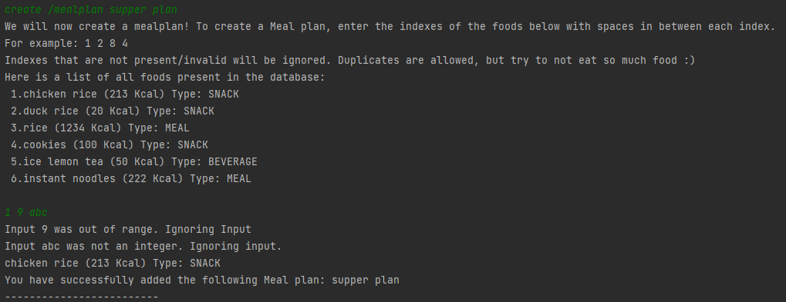
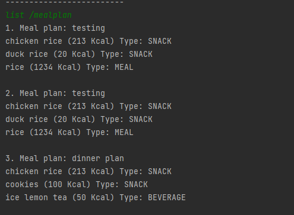

# User Guide

## Introduction

FitNUS Tracker is a desktop app for tracking daily food intake to keep a healthy lifestyle. FitNUS is specially made for Computing Students
living in University Town, with features and functionalities taylor made for them.
It is based on a Command Line Interface (CLI) and has rich functionality in order to cater to the needs of potential users.

Here is the list of sections we will be covering in this User Guide.

- [Quick Start](#quick-start)
- [Features](#features)
  - [Food Tracker](#food-tracker)
    - [Adding food tracker entry: `add`](#adding-food-tracker-entry-add)
    - [Adding meal plan entry: `add /mealplan`](#adding-meal-plan-entry-add-mealplan)
    - [Editing existing food tracker entry: `edit`](#editing-existing-food-tracker-entry-edit)
    - [Deleting food tracker entry: `remove /entry`](#deleting-food-tracker-entry-remove)
    - [Listing tracker entries: `list /entry`](#listing-tracker-entries-list)
    - [Searching for tracker entries with keyword: `find /entry`](#searching-for-tracker-entries-with-keyword-find)
  - [Food Database](#food-database)
    - [Deleting food from food database: `remove /food`](#deleting-food-from-food-database-remove)
    - [Searching for foods with keyword: `find /food`](#searching-for-foods-with-keyword-find)
    - [Listing foods in food database: `list /food`](#listing-foods-in-food-database-list)
  - [Meal Plan Database](#meal-plan-database)
    - [Creating new meal plan: `create /mealplan`](#creating-meal-plan-by-adding-food-create)
    - [Listing meal plan entries: `list /mealplan`](#listing-meal-plan-entries-list)
  - [Weight Tracker](#meal-plan-database)
    - [Recording weight: `weight /set`](#recording-weight-weight-set)
    - [Listing weight records: `list /weight`](#listing-weight-records-list)
  - [Personalisation](#personalisation)
    - [Setting gender: `gender /set`](#setting-gender-gender-set)
    - [Setting height: `height /set`](#setting-height-height-set)
    - [Setting age: `age /set`](#setting-age-age-set)
    - [Setting calorie goal: `calorie /set`](#setting-calorie-goal-calorie-set)
    - [Generate and set calorie goal: `calorie /generate`](#generate-and-set-calorie-goal-calorie-generate)
    - [View personal data: `list /user`](#view-personal-data-list-user)
  - [Other](#other)
    - [Viewing statistics: `summary`](#view-statistics-summary)
    - [Viewing help: `help`](#viewing-help-help)
    - [Getting food recommendations: `suggest`](#suggest-food-based-on-food-type-and-calorie-goal-suggest)
    - [Exiting FitNUS: `exit`](#quit-fitnus)
- [Command Summary](#command-summary)

---
## Quick Start

1. Ensure that you have Java 11 installed in your computer. 
2. Download the latest version of `fitNus.jar` from [here](https://github.com/AY2122S1-CS2113T-W12-1/tp/releases/tag/V2.0).
3. Copy the file to the folder you want to use as the home folder for your FitNUS Tracker.
4. Type the following command in your terminal to run this program:`java -jar FitNus.jar`
5. The application will prompt first-time users (i.e. users with incomplete or missing user data) to set up their profile. If you have successfully run the programme, you should see the following message as follows:
```
Welcome to FitNUS Tracker!
Successfully preloaded 0 foods
Successfully preloaded 0 entries
Successfully preloaded weight data
Please enter your gender (m/f):
```


## Features
> **⚠️ Notes about command format**
> 
> - Words in **UPPER_CASE** are the parameters to be input by the user!

>  e.g. in `add /food NAME`, NAME is a parameter which can be substituted as `add /food burgers`.
> - Items in **[Square brackets]** are optional!

>  e.g. `add [/MEALTYPE] FOOD_NAME` can be used as `add /lunch sandwiches` or `add sandwiches`.

### Food Tracker

#### Adding food tracker entry: `add`
Adds a food tracker entry to the food tracker and prompts the user to fill in any additional information needed if an exact match to the user inputted food name was not found in the food database. 

Format: `add [/MEALTYPE] FOOD_NAME`

* The `MEALTYPE` can be of the following 4 types:
  * `bfast` - to denote breakfast
  * `lunch` - to denote lunch
  * `dinner` - to denote dinner
  * `snack` - to denote snacks

> **⚠️ Notes about omitting `MEALTYPE`**
>
> The `MEALTYPE` will be automatically added based on the current time if not explicitly specified based on the following criteria:
>- Breakfast: 6am to 10am
>- Lunch: 11am to 2pm
>- Dinner: 6pm to 9pm
>- Snack: Remaining time
> 
> **If a backslash character ("/") is written as the first character of the food name when omitting the `MEALTYPE`, the app will reject the input!**
>
> Eg. The input `add /rice noodles` will be rejected, whereas the input `add /bfast /rice noodles` will be accepted.
* If there are any pre-set food that matches `FOOD_NAME`:
  * You can do one of the following:
    * Select which food you would like to add
    * Create your own custom food


Examples of usage: `add /bfast chocolate`

Sample output:
```
The following food category has been tagged: BREAKFAST
Searching for "chocolate"...
 [X] Select your desired food from the list below:
 1.chocolate bar (125 Kcal) Type: SNACK
 2.chocolate cake (300 Kcal) Type: SNACK
 3.chocolate croissant (120 Kcal) Type: MEAL
 4.chocolate rolls (110 Kcal) Type: SNACK
Don't see what you're looking for? Enter 0 to create your own food!
4
You have successfully added chocolate rolls (110 Kcal) Type: SNACK
```

<p>&nbsp;</p>

#### Adding meal plan entry: `add /mealplan`
Adds a meal plan consisting of existing food items. To create a meal plan, there needs to be at least 1 food item inside the food database.  

Format: `add /mealplan [/MEALTYPE] INDEX_OF_MEALPLAN`


> **⚠️ Notes about `INDEX_OF_MEALPLAN`**
>
> INDEX_OF_MEALPLAN refers to the index of the meal plan(s) shown when command `list /mealplan` is used.
>
> INDEX_OF_MEALPLAN must be an integer value and within the range shown above.


Examples of usage: `add /mealplan /dinner 1`

Sample output:




#### Editing existing food tracker entry: `edit`
Edits an existing food tracker entry's food information. FitNUS will search for FOOD_NAME in the food database 
and update the specified entry's food details accordingly.

Format: `edit INDEX_OF_ENTRY FOOD_NAME`
> **⚠️ Notes about `INDEX_OF_ENTRY`**
>
> INDEX_OF_ENTRY refers to the index of the entry shown when command `list /entry` is used.

* If there are any pre-set food that matches `FOOD_NAME`:
  * You can do one of the following:
    * Select which food you would like to add
    * Create your own custom food

Example of usage:
`edit 2 fish`

Sample output:


<p>&nbsp;</p>

#### Deleting food tracker entry: `remove`
Deletes a food tracker entry from the food tracker.

Format: `remove /entry INDEX_OF_FOOD`

Example of usage:

`remove /entry 2`

<p>&nbsp;</p>

#### Listing tracker entries: `list`
Lists out all foods entered for a given timeframe.

Format: `list /entry [/TIMEFRAME]`
* The `TIMEFRAME` can be of the following 2 types:
  * `day` - to show entries in the current day
  * `week` - to show entries in the past week

> **⚠️ Notes about omitting `TIMEFRAME`**
>
> Command will list out **ALL** available food entries.

Example of usage:
`list /entry /week`


<p>&nbsp;</p>

#### Searching for tracker entries with keyword: `find`
Finds all matching entries in the EntryDatabase based on the keyword you provided.

Format: `find /entry KEYWORD`

Example of usage:

`find /entry rice`

- Prints out all food entries that contains "rice".

<p>&nbsp;</p>

----

### Food Database

#### Deleting food from food database: `remove`
Deletes food from the food database.

Format: `remove /food INDEX_OF_FOOD`

Example of usage:

`remove /food 12`

- Removes the 12th food in the list of preset foods.

<p>&nbsp;</p>

#### Searching for foods with keyword: `find`
Finds all matching food in the FoodDatabase based on the keyword you provided.

Format: `find /food KEYWORD`

Example of usage:

`find /food rice`

- Prints out all preset foods that contains "rice".

<p>&nbsp;</p>

#### Listing foods in food database: `list`
Lists out all foods in the database and their respective calories.

Format: `list /food`

Example of usage:

`list /food`

<p>&nbsp;</p>

---- 

### Meal Plan Database

#### Creating meal plan by adding food: `create`
Creates a custom meal plan by adding existing food items inside the food database to the meal plan.

Format: `create /mealplan NAME_OF_MEALPLAN`

Once a valid `NAME_OF_MEALPLAN` has been added, you will be shown a list of food inside the database and will be prompted to input the indexes of the foods you want to include inside the meal plan.

> **⚠️ Notes about `NAME_OF_MEALPLAN`**
>
> `NAME_OF_MEALPLAN` must be at least 1 character in length. Pipe Characters will be automatically be replaced with a space character if included

> **⚠️ Notes about adding food items to meal plan**
>
> Only valid indexes entered will be parsed. The `index` MUST be an integer value and within the range of food items displayed. Invalid indexes will be ignored as shown below.

Example of usage:

`create /mealplan dinner plan`

`1 4 5` 

- All input indexes are valid

Sample output:




`create /mealplan supper plan`

`1 9 abc` 

- Input index `9` is not valid as it is outside the range of the food database.
- Input `abc` is not valid as it is not an integer.


Sample output:




#### Listing meal plan entries: `list`
Lists out all meal plans entered. A list of meal plans and its associated food items is displayed as shown below.

Format: `list /mealplan`


Example of usage:

`list /mealplan`

Sample output: 



<p>&nbsp;</p>

---- 

### Weight Tracker

#### Recording weight: `weight /set`
Updates the user's current weight as well as their weight record for the day in the weight tracker.

Format: `weight /set WEIGHT`

Example of usage:

`weight /set 55.6`

Sample Output:

```
You have updated your weight for today to 55.6 kg! You have gained 1.6 kg from the previous weight entry of 54.0 kg on 2021-10-31
```

<p>&nbsp;</p>


#### Listing weight records: `list`
Lists out all past records or the past month of weight entered by the user.

Format: `list /weight /all` or `list /weight /month MONTH_INTEGER`

Example of usage:

1. List the weight progress since the start of using FitNus: `list /weight /all` 

Sample output:

```
Your weight progress since the start of your FitNUS journey: 
2021-03-12: 51.5kg
2021-03-13: 51.7kg
2021-03-14: 51.8kg
2021-03-15: 51.9kg
2021-04-12: 54.2kg
2021-10-27: 63.3kg
2021-10-31: 54.0kg
2021-11-01: 55.6kg

You have gained 4.1 kg since the start of your FitNUS Journey!
```

2. List the weight progress of a certain month:`list /weight /month 3`

Sample output:

```
Your weight progress in March: 
2021-03-12: 51.5kg
2021-03-13: 51.7kg
2021-03-14: 51.8kg
2021-03-15: 51.9kg

You have gained 0.4 kg during the month of March!
```

<p>&nbsp;</p>

### Personalisation

####  Setting gender: `gender /set`
Sets the user's gender to either Male or Female.

Format: `gender /set GENDER_SYMBOL`

Example of usage: `gender /set m`

Sample output:
```
You have set your gender to Male
```

<p>&nbsp;</p>


####  Setting height: `height /set`
Sets the user's height in centimeters.

Format: `height /set HEIGHT`

Example of usage:`height /set 180`

Sample output:
```
You have set your height to 180 cm!
```

<p>&nbsp;</p>


####  Setting age: `age /set`
Sets the user's age in years.

Format: `age /set AGE`

Example of usage:`age /set 18`

Sample output:


<p>&nbsp;</p>

####  Setting calorie goal: `calorie /set`
Sets the user's calorie goal in kcal.

Format: `calorie /set CALORIE_GOAL`

Example of usage:`calorie /set 2000`

Sample output:


<p>&nbsp;</p>

####  Generate and set calorie goal: `calorie /generate`
Generates and sets a calorie goal based on the user's target weight loss/gain per week, age, height, weight and gender.
Format: `calorie /generate /WEIGHT_CHANGE_TYPE WEEKLY_TARGET`

* The `WEIGHT_CHANGE_TYPE` can be of the following 2 types: 
  * `lose` - to denote aiming to lose weight
  * `gain` - to denote aiming to gain weight

Example of usage:`calorie /generate /gain 0.5`

Sample output:


<p>&nbsp;</p>

#### View personal data: `list /user`
View all the personal body measurements including gender, age, weight, height and calorie goal.
Format: `list /user`

Sample output:


### Other

#### Viewing Help: `help`
Lists out available commands and additional information regarding each command.

Format: `help`

Sample Output:


<p>&nbsp;</p>

#### View statistics: `summary`
FitNUS supports two kinds of diet reports:


##### Weekly report
Weekly report gives you an overview of your diet over the past 7 days, which includes:
- Graph of daily calorie intake
- Average calorie intake
- Most frequently eaten foods
- Least frequently eaten foods

Format: `summary /week`

Sample Output:


##### Monthly report
Monthly report gives you an overview of your diet over this month, which includes:
- Average calorie intake
- Most frequently eaten foods
- Least frequently eaten foods

Format: `summary /month`

Sample Output:


<p>&nbsp;</p>

#### Suggest food based on food type and calorie goal: `suggest`
Filters food items in the database based on food type (meal, snack, beverage, others) 
that if consumed, will not exceed the daily calorie goal set by the user.

Format: `suggest /FOODTYPE [/sort]`

> **_OPTIONAL:_** You can sort the suggestions by calorie value by simply appending "/sort"
> to the command above e.g. suggest /FOODTYPE /sort

Example of usage:

`suggest /meal`

`suggest /snack /sort`

#### quit FitNus
Exit FitNus program

Format: `exit`

Sample Output:


## FAQ


## Command summary

Action | Command Format | Example
--- | --- | --- | 
Add food| add /MEALTYPE FOOD_NAME | `add /bfast chocolate rolls`
Add meal plan| add /mealplan /MEALTYPE MEALPLAN_INDEX | `add /mealplan /bfast 1`
Create meal plan| create /mealplan MEALPLAN_NAME | `create /mealplan bulking`
Edit | edit INDEX_OF_FOOD FOOD_NAME | `edit 1 burger`
Remove entry | remove /entry INDEX_OF_FOOD | `remove /entry 2`
Remove food | remove /food INDEX_OF_FOOD | `remove /food 12`
Find food | find /food KEYWORD | `find /food rice`
Find entry | find /entry KEYWORD | `find /entry rice`
List food | list /food | `list /food`
List meal plan | list /mealplan | `list /mealplan`
List all entries | list /entry | `list /entry`
List daily entry | list /entry | `list /entry /day`
List weekly entry | list /entry | `list /entry /week`
List weight record | list /weight | `list /weight`
View weekly statistics | summary /week | `summary /week`
View monthly statistics | summary /month | `summary /month`
Suggest food | suggest /FOODTYPE <br /> suggest /FOODTYPE /sort | `suggest /meal` <br /> `suggest /snack /sort`
Exit the program | exit |


